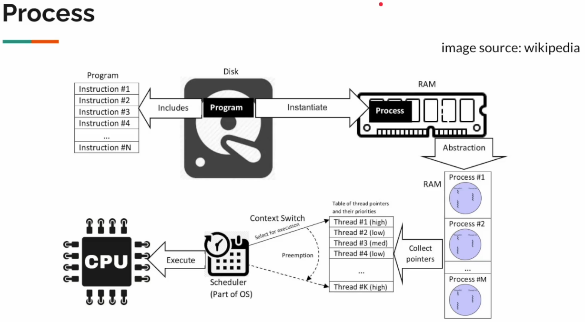
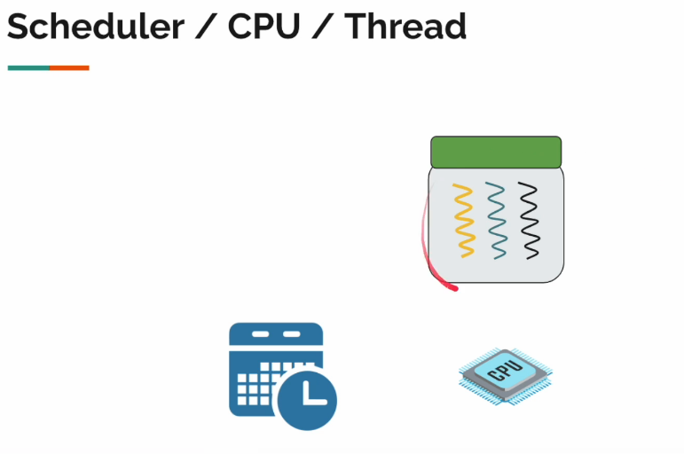
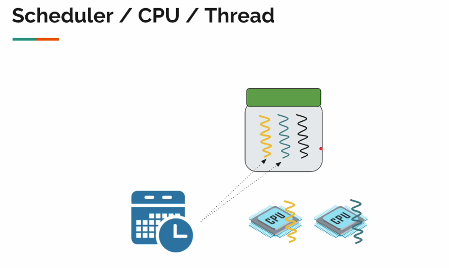

# Deep Dive into Virtual Threads

We need to start from understanding how OS works in a high level to fully understand the behavior of virtual threads.

Let's imagine you have developed a simple Java application and packaged it as a **.jar** file.

This **.jar** will be on the disk somewhere. Your program is nothing but a set of instructions that will be executed right now when we type the following command:

```
java -jar my-app.jar
```

When you enter this command, the **.jar** file will be loaded into the memory, you've just created a new process.

So a process is an instance of computer program which has its own isolated memory space. It will include code, data, other resources allocated by OS like memory socket, etc.



The process creation is heavy-weight operation, and lives inside the RAM. Just because it is there, that doesn't mean that it's executing CPU, which is responsible for executing the set of instructions.

## Threads

A Thread is a part of a process, and every process contains at least one thread, it can have more threads as well.

Threads within a process can share the memory space.

We can see the process as a unit of resources and the thread as a unit of execution.

Software like activity monitor enables us to see all the threads that are currently running and the amount of memory each process is using.

Let's consider the following example:



We have a process allocated in memory which has three threads. A CPU or processor. Your OS has something called a scheduler.

The scheduler is responsible for assign the threads to the CPU for execution and determine how long the thread can execute.

If you have only one processor, the scheduler will say - "Hey thread, you go and execute for some time." Then it will switch to the next thread and say - "Hey thread, you go and execute for some time." And so on.

So when you have only one process, only one processor, and multiple threads, it will switch between the threads.

If you have two processors, then it will try to assign one thread to each processor and execute them concurrently. Like this:



We refer to CPU and Processors interchangeably.

Modern CPUs comes with multiple **cores**. In this case, each core can be seen as a different processor.

By now, I hope we understand how the process, threads, RAM, CPU, and scheduler are related to each other.

Also, when we have a single processor and multiple programs running like your Chrome, IntelliJ, your Java application, etc., when they are all up and running, each and every process, they will have threads, and all these threads will be competing for the CPU. So your OS scheduler will keep on switching among threads for the execution. Will call that **context switching**.

When it switches from one thread to another, the current thread state (the execution point) has to be stored so that it can be resumed later from the point where it was stopped.

All that we're discussing so far has nothing to do specifically with Java. All processes work like that. These threads are called **OS threads** or **kernel threads**. This is how things are getting executed behind the scenes.

## Java (Platform) Thread

The original Java `Thread` class was introduced ~25 years ago. It is simply a **wrapper** around the OS thread, so one Java thread can be mapped to one OS thread.

Why the Java thread has to be a wrapper around the OS thread? Because, remember, it is the OS thread is the unit of scheduling. That is what gets executed by the processor, only via OS thread we can schedule something to execute.

## The high level

Our application code at high level looks like this:

```java
public class App {
    public static void main(String[] args) {
        // ...
    }

    public static void doSomething() {
        int i = 0;
    }

    public static void doSomethingElse() {
        double b = 1 + 2;
    }
}
```

When a Java thread executes these methods, the OS scheduler will keep switching threads. It has to store the methods local variables and these functions calls somewhere. We call that the **stack memory**.

## Heap vs Stack

Heap memory is where we store objects we dynamically create like `ArrayList` or `HashMap`, whatever you create.

Whereas the stack memory will contain the local variables, object references, and function call information, etc.

Each and every thread will have its own stack memory. The size of the stack memory is determined when the process starts or when the thread is created. It has to be given upfront, because once the thread is created, it cannot be changed.

By default, Java will assign 1 MB of stack memory to each thread. It might vary depending on the CPU architecture and the OS.

| OS | Size |
| --- | --- |
| Windows | Depends on virtual memory |
| Linux/x64 | 1024 KB |
| Linux/Aarch64 | 2048 KB |
| macOS/x64 | 1024 KB |
| macOS/Aarch64 | 2048 KB |

Whether the thread is doing any work or not, we have to set aside some memory for it.

## Conclusion

So far, so good. So where is the problem?

In the microservices architecture we have tons of network cards. For example, if we have to place one order, the `order-service` might have to call the `user-service`, the `payment-service`, the `shipping-service`, which might call another third party API, and each and every microservice might have their own databases, so it's another network call.


We can easily accumulate a lot of network calls, so a thread which is doing the request processing in the `order-service` is often times blocked due to the huge number of network calls. Once it calls the `user-service`, it is blocked until the response comes back, once it calls the `payment-service`, it is blocked and have to sit idle, and so on.

The problem is: we create an expensive thread, but we're keeping it idle so far in Java. This is the problem we're trying to solve with Java Virtual Threads.

But virtual threads are not OS threads, so how can we get them executed?