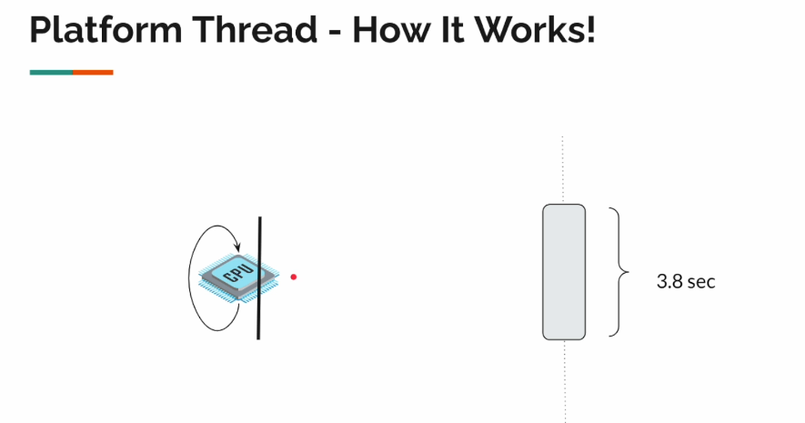
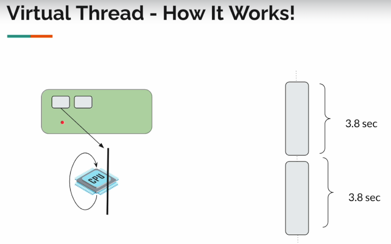

# Exploring Java Virtual Threads

Here is how we set up our project environment on IntelliJ IDEA:


We also need a few dependencies:

- Logback
- Enable preview of Java 21

The code will be updated as we go in the **virtual-threads-playground** project directory.

## Our goal

We had discussed already that in the microsservices architecture problem, we deal with tons of network calls, often times thread will be blocked, if we try to increase the number of threads then we have to allocate stack size for these threads which is expensive.

Let's verify if it's really expensive to create threads. Once we know the problem then we can understand the solution better.

To avoid confusions let's refer to Java `Thread` as platform thread. To simulate the slow network, I/O calls, we would be using `Thread.sleep()` in the first examples. Our examples on this section will be located on the package `section01`.

Let's create our first class named `Task` and there we will define a method to simulate the slow network call.

```java
public class Task {

    private static final Logger LOGGER = LoggerFactory.getLogger(Task.class);

    public static void ioIntensiveOp(int i) {

        try {
            LOGGER.info("starting I/O task: {}", i);

            Thread.sleep(Duration.ofSeconds(10));

            LOGGER.info("ending I/O task: {}", i);
        } catch (InterruptedException e) {
            throw new RuntimeException(e);
        }
    }
}
```

Now let's create our second class named `InboundOutboundTaskDemo` and there we will define a method to simulate the network calls.

```java
public class InboundOutboundTaskDemo {

    private static final int TEN_PLATFORM = 10;
    private static final int TEN_MILLION_PLATFORM = 10000000;

    public static void main(String[] args) {
        smallPlatformThreadDemo();
        /*
            Output should look like the following (order of tasks will vary at each call)
            00:38:26.722 [Thread-6] INFO com.bodera.section01.Task -- starting I/O task: 6
            00:38:26.722 [Thread-7] INFO com.bodera.section01.Task -- starting I/O task: 7
            00:38:36.731 [Thread-7] INFO com.bodera.section01.Task -- ending I/O task: 7
            00:38:36.731 [Thread-6] INFO com.bodera.section01.Task -- ending I/O task: 6
            ... (other threads goes along)

            We can actually name our Java threads (aka OS Threads) and for our virtual threads
         */

        //hugePlatformThreadDemo();
        // The line above is most probably expected to raise an OutOfMemoryException
    }

    private static void smallPlatformThreadDemo() {
        threadStarter(TEN_PLATFORM);
    }

    private static void hugePlatformThreadDemo() {
        threadStarter(TEN_MILLION_PLATFORM);
    }

    private static void threadStarter(int numberOfThreads) {
        for (int i = 0; i < numberOfThreads; i++) {
            int j = i;

            Thread thread = new Thread(() -> Task.ioIntensiveOp(j));
            thread.start();

            // On production code we really don't want to create threads like this
            // Is most common to use a thread pool executor service or something related
            // We are just using it here for learning purposes.
        }
    }
}
```

Behind the curtains, whenever we call `Thread.start()` Java calls a native method to create the underlying platform thread. This is the `pthread_create` which comes from a C library to create POSIX threads, it's a standard for creating threads in the Unix-like machines (Linux, Mac), but Windows machines Java may call `winpthreads` instead for doing this job.

So when we called `hugePlatformThreadDemo()` we get the following:

```bash
Failed to start thread "Unknown thread" - pthread_create failed (EAGAIN) for attribute: stacksize=2048k, guardsize=16k, detachstate.
Exception in thread "main" java.lang.OutOfMemoryError: unable to create native thread: possible out of memory or process/resource limits reached
at java.base/java.lang.Thread.start0(Native Method)
```

Is not always because system is out of memory that this exception is thrown, sometimes it can be because we have too many threads, or we have too many threads with too much stack size. The underlying OS will not give us the flexibility to create millions of threads.

## Thread builder factory method

Before JDK 21 we used to create threads by calling `new Thread(Runnable)` and then call `Thread.start()` to start the thread.

```java
Thread thread = new Thread(() -> Task.ioIntensiveOp(i));
thread.start();
```

Now in JDK 21 we can use a `Thread.Builder.OfPlatform` to create our threads.

```java
Thread thread = Thread.ofPlatform().unstarted(() -> Task.ioIntensiveOp(i));
thread.start();
```

When we create threads like this we call them **non-daemon threads** or **foreground threads**, so they will not be terminated when the main thread is terminated just only when the JVM is terminated (our main application). So after `threadStarter()` is done executing our non-daemon threads will not be terminated until our `InboundOutboundTaskDemo.main()` is terminated (which is our main application).

Sometimes you might want to create threads to run in background mode, we call them **daemon threads**. To create a daemon thread we use the `Thread.Builder.OfPlatform.daemon()` method.

```java
Thread thread = Thread.ofPlatform().daemon().unstarted(() -> Task.ioIntensiveOp(i));
thread.start();
```

If we try to run the daemon thread our application will just exit immediately.

```bash
> Task :compileJava
> Task :processResources NO-SOURCE
> Task :classes
> Task :com.bodera.section01.InboundOutboundTaskDemo.main()

BUILD SUCCESSFUL in 233ms
```

That's because in our `threadStarterDaemon()` our main thread created ten background threads, and it exits immediately after without waiting for daemon threads to complete their tasks. That's how daemon threads works.

But how can we make our applications wait the background threads to finish their execution? And how we are talking about this without mentioning virtual threads? And if we have to wait for the application to do the job, why we are creating daemon threads in the first place? We will have a better insight on this on the next section.

But first let's see how can we make our applications wait the background threads to finish their execution. That's a job for `CountDownLatch`.

The `CountDownLatch` is nothing new, was present in Java since 1.5as part of the `java.util.concurrent package`. It's a synchronization aid that allows one or more threads to wait until a set of operations being performed in other threads completes.

Common use cases for `CountDownLatch` include:

- Waiting for multiple threads to complete initialization before starting a service
- Coordinating the execution of multiple threads in a test scenario
- Implementing a "barrier" that allows threads to wait for each other to reach a certain point

So we can use it to wait for the background threads to complete their jobs.

```java
var latch = new CountDownLatch(numberOfThreads); //number of tasks

for (int i = 0; i < numberOfThreads; i++) {
    int j = i;

    Thread thread = Thread.ofPlatform().daemon().unstarted(() -> {
        Task.ioIntensiveOp(j);
        latch.countDown(); //decrement the count to indicate that the task is done
    }
    thread.start();
}
latch.await(); //wait until all tasks are done
```

In Java, a thread can be in a state where it has finished its task, but the thread itself is still alive. This is because the thread's task is typically executed in a `run()` method, and when that method completes, the thread's task is done. However, the thread itself may still be in a state where it's waiting for other threads to finish, or waiting for some other condition to be met, before it can actually exit.

Think of it like a worker who has finished their assigned task, but is still waiting for their manager to give them further instructions or to confirm that they can go home. The worker has finished their task, but they're still "on the clock" and haven't actually left the workplace yet.

In Java, when a thread finishes its task, it's said to be in a state of "completion", but it's not necessarily "terminated". A thread is only terminated when it's actually completed and is no longer running.

The `CountDownLatch` is typically used to wait for a thread to finish its task, whereas `Thread.join()` is used to wait for the thread to actually terminate.

Here's a code snippet combining `CountDownLatch` and `Thread.join()`:

```java
CountDownLatch taskCountDown = new CountDownLatch(numberOfThreads);
Thread.Builder.OfPlatform threadBuilder = Thread.ofPlatform().daemon().name("bodera.daemon", 1);

Thread[] threads = new Thread[numberOfThreads];

for (int i = 0; i < numberOfThreads; i++) {
    int j = i;

    threads[i] = threadBuilder.unstarted(() -> {
        Task.ioIntensiveOp(j);
        taskCountDown.countDown();
    });
    threads[i].start();
}

taskCountDown.await();

// Wait for each thread to finish
for (Thread thread : threads) {
    thread.join();
}
```

## Virtual threads scaling

We understood the problem with the platform threads, we reach some resource limits. At this point we can talk about virtual threads.

Java 21 has introduced a new class called `VirtualThread` which extends the original `Thread` class.

```
-> public Thread (Platform Thread)
----> abstract BaseVirtualThread
--------> (package private) VirtualThread
```

So consider the following code:

```java
void startThread(Thread thread) {
    thread.start();
}
```

On the example above the parameter `thread` can be either a platform thread or a virtual thread.

We cannot directly create a virtual thread by saying `new VirtualThread()` because it is package private. This is why Java has also introduced the `Thread.Builder`, which we have already used on previous examples. The `Thread.Builder` is an interface with two different implementations:

- `Thread.ofPlatform()` for creating platform threads
- `Thread.ofVirtual()` for creating virtual threads

Consider the following code:

```java
Thread createThread(Thread.Builder builder) {
    return builder.unstarted(() -> someTask());
}
```

On the example above we should be able to create both a platform thread or a virtual thread.

Now let's explore a bit more of virtual threads.

```java
public void static main(String[] args) {
    smallVirtualThread();
}

private static void threadStarterVirtual() {
    Thread.Builder.OfVirtual threadBuilder = Thread.ofVirtual().name("bodera.virutal", 1);

    for (int i = 0; i < 10; i++) {
        int j = i;

        Thread thread = threadBuilder.unstarted(() -> Task.ioIntensiveOp(j));
        thread.start();
    }
}
```

If we run the method `main()` we will get the following:

```bash
> Task :compileJav
> Task :processResources NO-SOURCE
> Task :classes
> Task :com.bodera.section01.InboundOutboundTaskDemo.main()
BUILD SUCCESSFUL in 5s

Process finished with exit code 0
```

We get no output! That's because virtual threads are daemon threads by default. We cannot create a non-daemon virtual thread.

So let's try to apply `CountDownLatch` to virtual threads.

```java
public void static main(String[] args) {
    threadStarterVirtualSync();
}

private static void threadStarterVirtualSync() {
    try {
        CountDownLatch taskCountDown = new CountDownLatch(10);
        Thread.Builder.OfVirtual threadBuilder = Thread.ofVirtual().name("bodera.virtual", 1);

        for (int i = 0; i < 10; i++) {
            int j = i;

            Thread thread = threadBuilder.unstarted(() -> {
                Task.ioIntensiveOp(j);
                taskCountDown.countDown();
            });
            thread.start();
        }

        taskCountDown.await();
    } catch (InterruptedException e) {
        throw new RuntimeException(e);
    }
}
```

If we run the method `main()` we will get the following:

```bash
> Task :compileJava
> Task :processResources NO-SOURCE
> Task :classes
> Task :com.bodera.section01.InboundOutboundTaskDemo.main()

10:33:21.785 [bodera.virtual7] INFO com.bodera.section01.Task -- starting I/O task: 6
10:33:21.785 [bodera.virtual2] INFO com.bodera.section01.Task -- starting I/O task: 1
// ....
10:33:31.803 [bodera.virtual1] INFO com.bodera.section01.Task -- ending I/O task: 0
10:33:31.804 [bodera.virtual5] INFO com.bodera.section01.Task -- ending I/O task: 4

BUILD SUCCESSFUL in 10s

Process finished with exit code 0
```

Virtual threads are **unnamed by default**. We can name them by using the `Thread.Builder.OfVirtual.name()` method.

Now where they really shines is about resource management. Remember when we get out of limits when creating tons of platform threads? Virtual threads are the perfect solution for that, also known as fibers or green threads, they are lightweight threads that run on top of a single operating system thread. They are scheduled by the Java Virtual Machine (JVM) and do not have a direct mapping to a native thread. This means that virtual threads do not run in parallel with the main thread in the classical sense, but rather are executed by the JVM in a way that mimics parallelism.

## How virtual threads work

Okay, Java virtual threads are simply an illusion provided by Java:

- It will look like a thread
- It will accept a `Runnable`
- We can do `thread.start()` and `thread.join()` as usual

But the underlying operating system cannot see/schedule them! If the underlying OS doesn't handle virtual threads then how does it work?

To understand virtual threads, let's consider the following example:


Your machines consist in the parts shown in the figure above. Whatever the code we write, object-oriented programming, functional style, reactive programming, all those things do not matter to the OS, programming paradigm only matters for us developers not for the OS.

So the programming languages are an interface in which we interact with the OS to pass some given set of instructions to perform.

In our first demo, the `platformThreadDemo()`, we were trying to create thousands of Java threads. And Java threads are the same as platform threads, so because of that it was trying to create too many OS threads, then the OS itself started providing some kind of restriction blocking our app to invoke the creation of more threads.


Now the thing is, when we create virtual threads they are just like regular objects like this one:

```java
Person p = new Person("Alice");
```

By looking at the statement above, we should no worry about creating thousands instances of `Person` in a loop, right? We could store them in data structure similar to an `ArrayList` or something related.

Similarly, the virtual threads are not platform threads, so nothing is created in the OS level! They are like tiny objects we create in the heap memory.


To understand virtual thread, we should stop seeing them as `Thread`, instead we should start seeing them as `Task`.

Those virtual threads, they accept a `Runnable`, right? So they all hold some kind of actions to be executed. It will look like we are using a thread, that we are even starting a new thread and doing something with the thread. However, whenever we call `Thread.Builder.OfVirtual.start()`, all those tasks, those virtual threads, they are going to be added to a **queue** on the RAM.


If the OS processor cannot be aware of the existence of virtual threads then it cannot execute them on its own. They belong to a _fork-join pool_, not the common pool of threads. The number of threads in this _fork-join pool_ depends on the number of processors we have in our machine. Consider that due to our single core CPU in our example, the _fork-join pool_ is going to be a single thread, a **platform thread**. This dedicated platform thread will take the tasks from the queue and will start executing them.

So behind the scenes, all the virtual threads, everything is getting executed by a platform thread. How many platform threads will be used for that depends on the number of processors available on the machine.

But as part of the `Runnable` we had given `Thread.sleep()`, if the platform thread is what is actually executing that task, then this platform thread should be blocked, right? How come we were able to execute millions of `Thread.sleep()` in parallel? Sounds unreasonable, right?

This is where Java does it magic.


Ok, the platform thread will pick up the task and will start executing whenever it sees a `Thread.sleep()` or some kind of network call, whenever it detects this type of blocking, what it will do is take that task and put it back into the **heap**, we call that action __"parking"__. The ultimate goal is that the platform thread should never be blocked, as long as there are available tasks on the **queue**, the platform thread will start executing them and when it detects some blocking call or network call, it stages the idle task back into the heap till the response comes back.


We name these platform threads as _"carrier threads"_. Since the virtual threads are tiny objects in the heap, and they cannot be directly executed on its own, the virtual threads will have to be __mounted__ on a carrier thread to execute their task.

Then we will be executing the task as part of the `Runnable`. Let's imagine that we're calling a remote service `ProductService` to get the product information. So we will be sending a request to the product service to get the product information, since it's a network call, it might take some time, so we will not be waiting till the response comes back. The virtual thread that performed that call will be __unmounted__ and then __parked__ back into the queue. Then the next available virtual thread on the queue will be mounted again to get executed. The strategy consists in not letting the carrier thread to be set idle, repeating this process over and over.

What happens if the response comes back? Then we're going to __unpark__ the virtual thread by adding it back to the __queue__ so that it can be __mounted__ on a carrier thread again to execute its task. It will continue from the place where it stopped.

We're going to get in details on how this work further on our lectures, but in a high level, this is how the virtual threads are getting scheduled for the execution.

If the virtual thread is mounted on a carrier thread, and if the carrier thread is what is executing the task, then we have some methods like:

```java
Thread.currentThread().getName();
Thread.currentThread().getState();
```

If we call upon these methods, what will be the output? Would we get the virtual thread name and state, or the carrier thread name and state? That's a very good question.

Okay, so the virtual thread is mounting on a carrier thread and all its implementation details. You and I are the Java developers, so basically we are the users of the Java platform ok. For us there are two threads, one is virtual, the other one is platform. So the Java is trying to provide the magic illusion behind the scenes for us, but in this case when we are using virtual threads in our code, we should be getting the virtual thread name and state. But how does it happen?

Check out the following code from the `VirtualThread.mount()` method:

```java
/**
 * Mounts this virtual thread onto the current platform thread. On
 * return, the current thread is the virtual thread.
 */
@ChangesCurrentThread
@ReservedStackAccess
private void mount() {
    // sets the carrier thread
    Thread carrier = Thread.currentCarrierThread();
    setCarrierThread(carrier);

    // sync up carrier thread interrupt status if needed
    if (interrupted) {
        carrier.setInterrupt();
    } else if (carrier.isInterrupted()) {
        synchronized (interruptLock) {
            // need to recheck interrupt status
            if (!interrupted) {
                carrier.clearInterrupt();
            }
        }
    }

    // set Thread.currentThread() to return this virtual thread
    carrier.setCurrentThread(this);
}
```

After mounting the virtual thread on a carrier thread, we are also modifying the carrier thread on this line `carrier.setCurrentThread(this);`. This process is reverted when we call `VirtualThread.unmount()`.

If we look at `Thread.sleep()`, the actual Java source code looks like this:

```java
public static void sleep(long nanos) throws InterruptedException {
    if (currentThread() instanceof VirtualThread vthread) {
        vthread.sleepNanos(nanos); // if is virtual sleep this way
    } else {
        sleep0(nanos); // if is platform sleep this way
    }
}
```

The native `sleep0()` is a native method call where we ask the OS to not schedule the current thread for given nanoseconds. So that any further instructions will not be executed for the given nanoseconds. This is a blocking operation.

The `sleepNanos()` method on other hand performs another call to the `parkNanos()` methods to park the current virtual thread for the given nanoseconds. Inside there it will also immediately schedule unparking after the given nanoseconds by calling this:

```java
Future<?> unparker = scheduleUnpark(this::unpark, nanos);
```

Again, that task will be taken and added to the queue after the given nanoseconds. This is how virtual threads looks like in slept state. The Java team have modified hundreds of files for us.

Now what about the stack memory? Threads will have something like a stack memory right, so those virtual threads are supposed to have something like that too. Do they have or not? We will explain that in the next lecture.

### A note about virtual threads and fork-join pool

The fork-join pool is a type of executor service in Java that's designed to efficiently execute tasks that can be divided into smaller sub-tasks. It's particularly useful for parallelizing computationally intensive tasks.

In the context of Java virtual threads (also known as _"fibers"_ or _"green threads"_), a fork-join pool can be used to execute tasks that are scheduled on a dedicated platform thread. This means that the fork-join pool will use a native thread to execute the tasks, but the tasks themselves will be executed as virtual threads.

The idea is that the platform thread will act as a "carrier" for the virtual threads, allowing them to run on the native thread while still providing the benefits of virtual threads, such as lightweight scheduling and reduced memory overhead.

By using a fork-join pool with virtual threads, you can take advantage of the efficiency and scalability of parallel processing while minimizing the overhead of thread creation and management.

```java
import java.util.concurrent.ForkJoinPool;
import java.util.concurrent.RecursiveTask;

public class VirtualThreadExample extends RecursiveTask<Integer> {
    // ...

    public static void main(String[] args) {
        ForkJoinPool pool = new ForkJoinPool();
        VirtualThreadExample task = new VirtualThreadExample();
        pool.invoke(task);
    }
}
```

Note that this is just a brief overview, and there are many more details to explore when working with fork-join pools and virtual threads in Java.

By default, a `ForkJoinPool` will use a target parallelism level that's equal to the number of available processors, which is typically the number of cores on your machine. However, the actual number of platform threads used by the pool can vary depending on the workload and the configuration of the pool.

In your case, if you have 10 processors available, the `ForkJoinPool` will likely use a target parallelism level of 10, which means it will try to use up to 10 platform threads to execute tasks concurrently. However, the pool may not always use all 10 threads simultaneously, and it may also use more threads than the target parallelism level if the workload requires it.

You can also configure the parallelism level of the `ForkJoinPool` explicitly by passing a value to the constructor, like this:

```java
ForkJoinPool pool = new ForkJoinPool(10);
```

This sets the target parallelism level to 10, but again, the actual number of platform threads used by the pool may vary.

It's worth noting that `ForkJoinPool` uses a technique called _"work-stealing"_ to manage its threads, which means that idle threads will actively search for work to do, and busy threads will try to offload work to idle threads. This helps to ensure that the pool is using its threads efficiently, even if the workload is uneven.

## Carrier threads demo

On the previous lesson we saw how virtual threads works behind the scenes, and how they get executed by carrier threads. Let's see carrier threads in action.

First we need to modify the `Task` class a bit.

```java
public static void ioIntensiveOp(int i) {
    try {
        LOGGER.info("starting I/O task: {}. Thread info: {}", i, Thread.currentThread());

        Thread.sleep(Duration.ofSeconds(10));

        LOGGER.info("ending I/O task: {}. Thread info: {}", i, Thread.currentThread());
    } catch (InterruptedException e) {
        throw new RuntimeException(e);
    }
}
```

After that, let's go back to out `InboundOutboundTaskDemo` class and check how the platform threads are getting executed after our modification on the `Task` class.

```java
public class InboundOutboundTaskDemo {

    public static void main(String[] args) {
        smallPlatformThreadNonDaemon();
    }
}
```

Sample output:

```
> Task :com.bodera.section01.InboundOutboundTaskDemo.main()
02:19:49.391 [bodera4] INFO com.bodera.section01.Task -- starting I/O task: 4. Thread info: Thread[#32,bodera4,5,main]
// ....
02:19:49.391 [bodera10] INFO com.bodera.section01.Task -- starting I/O task: 10. Thread info: Thread[#38,bodera10,5,main]
02:19:49.391 [bodera7] INFO com.bodera.section01.Task -- starting I/O task: 7. Thread info: Thread[#35,bodera7,5,main]
02:19:49.391 [bodera8] INFO com.bodera.section01.Task -- starting I/O task: 8. Thread info: Thread[#36,bodera8,5,main]
02:19:49.391 [bodera9] INFO com.bodera.section01.Task -- starting I/O task: 9. Thread info: Thread[#37,bodera9,5,main]
```

Let's dissect this a bit more.

```
Thread info: Thread[#37,bodera9,5,main]
```

* `Thread info` is the header indicating that the following information is about a thread.
* `#37` is the thread ID, a unique identifier for the thread.
* `bodera9` is the thread name, which can be set by the developer or automatically generated by the JVM.
* `5` is the thread priority, which determines the order in which threads are scheduled to run.
* `main` is the thread group, which is a way to organize related threads together. But it can also be the parent thread's name.

Now let's examine the output of the `InboundOutboundTaskDemo` class when we run it for virtual threads.

```java
public class InboundOutboundTaskDemo {

    public static void main(String[] args) {
        smallVirtualThreadNonDaemon();
    }
}
```

Sample output:

```
> Task :com.bodera.section01.InboundOutboundTaskDemo.main()
02:26:54.141 [bodera.virtual10] INFO com.bodera.section01.Task -- starting I/O task: 10. Thread info: VirtualThread[#39,bodera.virtual10]/runnable@ForkJoinPool-1-worker-10
02:26:54.141 [bodera.virtual9] INFO com.bodera.section01.Task -- starting I/O task: 9. Thread info: VirtualThread[#38,bodera.virtual9]/runnable@ForkJoinPool-1-worker-9
// ....
```

Let's dissect this a bit more.

```
Thread info: VirtualThread[#34,bodera.virtual5]/runnable@ForkJoinPool-1-worker-5
```

* `Thread info` is the header, as before.
* `VirtualThread` indicates that this is a virtual thread, which is a lightweight thread that can be used for concurrent programming.
* `[#34,bodera.virtual5]` is the thread ID and name, similar to before.
* `/runnable` indicates the thread's current state, which is "runnable". This means the thread is ready to run and is waiting for the scheduler to allocate it a CPU.
* `@ForkJoinPool-1-worker-5` is the thread's context, which indicates that it's part of a ForkJoinPool. Specifically, it's worker thread #5 in pool #1.

So as we proved, virtual threads can't execute themselves, they must run upon a `ForkJoinPool`'s worker thread.

Now let's take the `ForkJoinPool-1-worker-5` to see what's going on. The full line when it was in the starting state looks like this:

```
02:26:54.141 [bodera.virtual5] INFO com.bodera.section01.Task -- starting I/O task: 5. Thread info: VirtualThread[#34,bodera.virtual5]/runnable@ForkJoinPool-1-worker-5
```

It was linked to the task `[bodera.virtual5]` right? But since it was sleeping, the carrier thread must have parked this thread, and later unparked it. As we can see in the full line of the ending state:

```
02:27:04.172 [bodera.virtual5] INFO com.bodera.section01.Task -- ending I/O task: 5. Thread info: VirtualThread[#34,bodera.virtual5]/runnable@ForkJoinPool-1-worker-3
```

Notice how a different worker thread was selected to continue the ending state of the task `bodera.virtual5` virtual thread. It was initialized with `ForkJoinPool-1-worker-5` and finally ended up with `ForkJoinPool-1-worker-3`.

We're observing is a common behavior in `ForkJoinPool`, where a virtual thread can be executed by different worker threads at different points in its lifetime.

Here's what's happening:

1. When the virtual thread bodera.virtual5 is created, it's assigned to worker thread ForkJoinPool-1-worker-5 (as seen in the starting state).
2. When the virtual thread needs to block (e.g., due to I/O or sleep), the carrier thread (in this case, ForkJoinPool-1-worker-5) parks the virtual thread, releasing its resources.
3. Later, when the virtual thread is unparked and ready to continue execution, the ForkJoinPool's scheduler assigns it to a new worker thread, which happens to be ForkJoinPool-1-worker-3 (as seen in the ending state).

This behavior is known as "work stealing" or "thread migration". The idea is that the `ForkJoinPool`'s scheduler can dynamically reassign tasks (virtual threads) to different worker threads to optimize resource utilization and minimize idle time.

In this case, the scheduler decided to move the virtual thread of the task `bodera.virtual5` from worker thread `ForkJoinPool-1-worker-5` to `ForkJoinPool-1-worker-3` when it was unparked. This might be because `ForkJoinPool-1-worker-5` was busy with other tasks or was idle, and the scheduler wanted to utilize `ForkJoinPool-1-worker-3` instead.

So, to summarize, the change in worker thread from `ForkJoinPool-1-worker-5` to `ForkJoinPool-1-worker-3` is a result of the `ForkJoinPool`'s scheduler dynamically reassigning the virtual thread to optimize resource utilization.

In this case, the `ForkJoinPool` is acting as the **carrier thread pool**, not just a single carrier thread!

The `ForkJoinPool` is a thread pool that manages a set of worker threads, and it's responsible for executing the virtual threads. When a virtual thread is created, it's submitted to the `ForkJoinPool`, which then assigns it to one of its worker threads for execution.

So, in this case, the `ForkJoinPool` is the entity that's managing the execution of the virtual threads, including task `bodera.virtual5`. The worker threads within the `ForkJoinPool`, such as `ForkJoinPool-1-worker-5` and `ForkJoinPool-1-worker-3`, are the actual threads that execute the virtual threads.

Think of it like a hierarchy:

- ForkJoinPool (carrier thread pool)
  - Worker threads (e.g., ForkJoinPool-1-worker-5, ForkJoinPool-1-worker-3)
    - Virtual threads (e.g., bodera.virtual5)

Virtual threads are an abstraction provided by Java to simplify concurrent programming and optimize resource management. They're designed to make it easier to write concurrent code without worrying about the underlying thread management.

In reality, virtual threads are not actual threads in the classical sense. Instead, they're a way to execute tasks on a pool of underlying threads, which are managed by the Java runtime. This approach allows for more efficient use of resources, as the number of underlying threads can be dynamically adjusted based on the workload.

By using virtual threads, you can write concurrent code that's more concise, readable, and maintainable, without having to worry about the complexities of thread management. The Java runtime takes care of the underlying thread scheduling, synchronization, and resource allocation, freeing you to focus on the logic of your program.

There is no guarantee that the same worker/carrier thread will be doing all the execution for the virtual thread.

## Virtual threads and Stack memory

Now let's discuss how the stack memory work with virtual threads, because we know that platform threads will have something called **stack memory** to store the local method variables, method calls information, etc. But what about virtual threads? How this data is keep in memory for virtual threads?

- Platforms threads have **fixed stack**. (1MB, 2MB, ...)

Even though we can adjust the stack size, remember that the size has to be given upfront before we create them. Once the platform thread is created we cannot adjust the stack size anymore, and it has to be a reasonable size.

- Virtual threads do NOT have fixed stack. They have **resizable stack**.
  - Stack Chunk Object

The way in which it works have to be visualized with the following figure:


Imagine that the virtual thread class is implemented like that pseudocode which accepts a `Runnable` that represents the task to be executed, and they have internally an object called `VirtualStack`.

Based on that class we create three virtual threads, which means three tasks to be executed right. We allocate those objects in the heap. The blue boxes are the runnable tasks, and the white ones are the virtual stack that is always initialized as null, since the task is not yet executed.

Then we have in our example a single processor. The long box corresponds to the carrier thread and the short box corresponds to the available stack memory for the carrier thread (a fixed stack of 1MB or 2MB, doesn't really matter for now).

So when we say `Thread.start()` our virtual threads will be added to a queue for execution, and they're ready to be picked up by a carrier thread for the execution.


Let's imagine that the carrier thread picked up the first task to start executing it. It loads the runnable, or start the virtual thread task as part of the runnable, and maybe we are creating a lot of objects inside, and also having a lot of methods to be called one by one. So, on behalf of the virtual thread, we will be doing everything.

During the execution, the method call information object references, everything has to be stored in the stack, thus our carrier thread will be using its stack memory. Like the red box in the figure below.


Now it has 1GB of stack memory, but probably it would have utilized 10KB or 100KB depending on the task we have inside the runnable. Just keep in mind that all relevant data to the task will be written on the stack (method calls, object references, stack trace, etc.).

During the execution, let's imagine that in the middle of the runnable we have to call a `ProductService` to get some product data. On behalf of the virtual thread the carrier thread will now perform a network call by sending a request to the `ProductService`.


It sends the request, then the platform/carrier thread will immediately realize - "Okay, this is a blocking call, I do not want to be blocked." - What it will do is transfer all that previous information gathered in the stack memory to the that tiny white box on the left side, before performing the **park**.


After completing the parking process, the stack memory will be cleaned because whatever it was storing doesn't belong to the carrier thread anymore, it belongs to the virtual thread that is now in the heap. A little recap, virtual thread executes and the carrier thread notices a blocking I/O call, it allocates the virtual thread and its related stack information on the heap before parking then, after that the carrier thread will pick the next task for the execution, and repeating this process over and over again.

Eventually, for each and every virtual thread, the corresponding stack information will be filled as part of the `VirtualThread` object itself (the pseudocode class). So the stack is now part of the heap, and each virtual thread has its own stack (one has 1KB, other has 250KB, etc.), this is why virtual threads have resizable stack memory.


Depending on the task we are executing they do not have a fixed memory, and they also become part of the heap. That's why virtual threads have resizable stack memory. It's worth noting that the stack memory is not necessarily resized dynamically. Instead, the Java runtime may allocate a larger or smaller stack size for each virtual thread based on the specific requirements of the task being executed.

Now you might wonder, after we have done all the parking, and sent messages to the `ProductService`, what will happen when we get the response back?


Well, once we get the response back, some carrier thread will unpark the virtual thread, and it goes back to the queue to continue the execution. It has to start from the place where it has stopped right? To be able to doing so, the carrier thread will not be losing the context because once it picks the task, every piece of relevant information (methods, object variable, etc.) will be restored back to the stack and then the task will be continued. Due to the object that contains a reference to the stack `VirtualStack` we will not be losing the context.

That does not come for free, it has some cost involved, however this is better than managing thousands of platform threads.

## Exploring Threads Stack Trace

Let's explore a demo where we're going to have a chain of method calls, and a few exceptions will be thrown along the way. We expect to see the stack trace in the logs from the virtual threads.

First we're going to define a utility class to encapsulate the call to `Thread.sleep()`, so we don't have to worry about the `InterruptedException` on the main thread.

```java
public class ThreadUtils {

    public static void sleep(Duration duration) {
        try {
            Thread.sleep(duration);
        } catch (InterruptedException e) {
            throw new RuntimeException(e);
        }
    }
}
```

Our `Task` class will be defined as follows:

```java
public class Task {

    private static final Logger LOGGER = LoggerFactory.getLogger(Task.class);

    public static void execute(int i) {
        LOGGER.info("stating task {}", i);

        try {
            method1(i);
        } catch (Exception e) {
            LOGGER.error("error for {}", i, e);
        }

        LOGGER.info("ending task {}", i);
    }

    public static void method1(int i) {
        ThreadUtils.sleep(Duration.ofMillis(300));

        try {
            method2(i);
        } catch (Exception e) {
            throw new RuntimeException(e);
        }
    }

    public static void method2(int i) {
        ThreadUtils.sleep(Duration.ofMillis(100));
        method3(i);
    }

    public static void method3(int i) {
        ThreadUtils.sleep(Duration.ofMillis(500));

        if (i != 4) return;

        throw new IllegalArgumentException("i cannot be 4.");
    }
}
```

And our main class will be defined as follows:

```java
public class StackTraceDemo {

    public static void main(String[] args) {
        
    }

    private static void demo(Thread.Builder builder) {
        for (int i = 1; i <= 20; i++) {
            int j = i;

            builder.start(() -> Task.execute(j));
        }
    }
}
```

First we're going to experiment platform threads.

```java
public class StackTraceDemo {

    public static void main(String[] args) {

        demo(Thread.ofPlatform());
    }
}
```

As output, we get:

```
01:19:59.699 [Thread-11] INFO com.bodera.section02.Task -- stating task 12
01:19:59.699 [Thread-14] INFO com.bodera.section02.Task -- stating task 15
01:19:59.699 [Thread-10] INFO com.bodera.section02.Task -- stating task 11
01:20:00.630 [Thread-11] INFO com.bodera.section02.Task -- ending task 12
01:20:00.630 [Thread-15] INFO com.bodera.section02.Task -- ending task 16
01:20:00.630 [Thread-12] INFO com.bodera.section02.Task -- ending task 13
01:20:00.630 [Thread-3] ERROR com.bodera.section02.Task -- error for 4
java.lang.RuntimeException: java.lang.IllegalArgumentException: i cannot be 4.
	at com.bodera.section02.Task.method1(Task.java:34)
	at com.bodera.section02.Task.execute(Task.java:20)
	at com.bodera.section02.StackTraceDemo.lambda$demo$0(StackTraceDemo.java:13)
	at java.base/java.lang.Thread.run(Thread.java:1583)
Caused by: java.lang.IllegalArgumentException: i cannot be 4.
	at com.bodera.section02.Task.method3(Task.java:48)
	at com.bodera.section02.Task.method2(Task.java:40)
	at com.bodera.section02.Task.method1(Task.java:32)
	... 3 common frames omitted
Caused by: java.lang.IllegalArgumentException: i cannot be 4.

01:20:00.633 [Thread-3] INFO com.bodera.section02.Task -- ending task 4
```

As we expected our threads has ended and when `i` was 4, the exception was thrown. Normally this is how we will be seeing some error stack trace and that's all right for debugging purposes.

Now let's experiment virtual threads.

```java
public class StackTraceDemo {

    public static void main(String[] args) {

        demo(Thread.ofVirtual());
    }
}
```

As output, we get:

```
1:26:14 AM: Executing ':com.bodera.section02.StackTraceDemo.main()'…

> Task :compileJava
> Task :processResources NO-SOURCE
> Task :classes
> Task :com.bodera.section02.StackTraceDemo.main()

BUILD SUCCESSFUL in 779ms
2 actionable tasks: 2 executed
1:26:15 AM: Execution finished ':com.bodera.section02.StackTraceDemo.main()'.
```

We know that virtual threads are the same as daemon threads, right? We have to block the execution somehow.

```java
public class StackTraceDemo {

    public static void main(String[] args) {

        demo(Thread.ofVirtual());
        ThreadUtils.sleep(Duration.ofSeconds(2));
    }
}
```

As output, we get:

```
01:28:25.470 [bodera-virtual-16] INFO com.bodera.section02.Task -- stating task 16
01:28:25.470 [bodera-virtual-19] INFO com.bodera.section02.Task -- stating task 19
01:28:25.470 [bodera-virtual-20] INFO com.bodera.section02.Task -- stating task 20
01:28:26.409 [bodera-virtual-2] INFO com.bodera.section02.Task -- ending task 2
01:28:26.409 [bodera-virtual-10] INFO com.bodera.section02.Task -- ending task 10
01:28:26.409 [bodera-virtual-14] INFO com.bodera.section02.Task -- ending task 14
01:28:26.410 [bodera-virtual-4] ERROR com.bodera.section02.Task -- error for 4
java.lang.RuntimeException: java.lang.IllegalArgumentException: i cannot be 4.
	at com.bodera.section02.Task.method1(Task.java:34)
	at com.bodera.section02.Task.execute(Task.java:20)
	at com.bodera.section02.StackTraceDemo.lambda$demo$0(StackTraceDemo.java:19)
	at java.base/java.lang.VirtualThread.run(VirtualThread.java:309)
Caused by: java.lang.IllegalArgumentException: i cannot be 4.
	at com.bodera.section02.Task.method3(Task.java:48)
	at com.bodera.section02.Task.method2(Task.java:40)
	at com.bodera.section02.Task.method1(Task.java:32)
Caused by: java.lang.IllegalArgumentException: i cannot be 4.

	... 3 common frames omitted
01:28:26.412 [bodera-virtual-4] INFO com.bodera.section02.Task -- ending task 4
```

Again we've started 20 threads in parallel, and they all got executed, and there we've got the same similar exception but this time from a virtual thread with stack trace.

The first run from the platform thread we have this line:

```
at java.base/java.lang.Thread.run(Thread.java:1583)
```

Now with daemon threads we have this line:

```
at java.base/java.lang.VirtualThread.run(VirtualThread.java:309)
```

We can conclude that even though our virtual threads got parked and unparked we are still able to get the stack trace for debugging purpose as usual.

## CPU intensive tasks with platform threads

Based on our understanding so far about the understanding so far about the platform and daemon threads, what do you think will happen when if we have a CPU intensive task? Here by CPU intensive, consider literally no I/O task.

Let's take the Fibonacci sequence where each number is the sum of the previous two numbers.

```
0, 1, 1, 2, 3, 5, 8, 13, 21, 34, 55, 89, 144, 233, 377, 610, 987, 1597, 2584, 4181, 6765, ...
```

Imagine that we're storing this sequence in an array, and now we're going to pass the position, and we would like to know what is the number in the sequence based on the position. For example, if you're given `5`, then is expected that you return the fifth number in the Fibonacci sequence, in that case it will be `5`. Similarly, if you're given `10`, then it will be `55`, etc.

To simulate an CPU intensive task, we can set up with something like this:

```java
// 2 ^ N algorithm - intentionally built this way to simulate a CPU intensive task using tons of recursive calls
public static long findFibonacci(long position) {
    if (position < 2) {
        return position;
    }

    return findFibonacci(position - 1) + findFibonacci(position - 2);
}
```

In real life, CPU intensive tasks are presented on different ways, like serialization and deserialization, or image processing, but we can use this algorithm as a starting point.

Before we continue, let's add one more utility method to our `TaskUtils` class which is going to measure how long it takes to execute the runnable.

```java
public static String measure(Runnable runnable) {
    long start = System.nanoTime();
    runnable.run();
    long end = System.nanoTime();

    double miliseconds = (end - start) / 1_000_000D;
    return String.format("%.2f", miliseconds / 1000D);
}
```

Now let's jump into the code:

```java
public class Task {

    // 2 ^ N algorithm - intentionally built this way to simulate a CPU intensive task using tons of recursive calls
    public static long findFibonacci(long position) {
        if (position < 2) {
            return position;
        }

        return findFibonacci(position - 1) + findFibonacci(position - 2);
    }
}

public class CPUTaskDemo {

    public static void main(String[] args) {
        System.out.println(
            ThreadUtils.measure(() -> Task.findFibonacci(30))
        );
    }
}
```

As output, we get something like this:

```
2.89 seconds
```

Let's enhance our demo a bit:

```java
public class Task {

    private static final Logger LOGGER = LoggerFactory.getLogger(Task.class);

    public static void cpuIntensive(int i) {
        LOGGER.info("starting CPU task. Thread info: {}", Thread.currentThread());
        var timeTaken = ThreadUtils.measure(() -> findFibonacci(i));
        LOGGER.info("ending CPU task. Time taken was: {} seconds.", timeTaken);
    }

    // 2 ^ N algorithm - intentionally built this way to simulate a CPU intensive task using tons of recursive calls
    public static long findFibonacci(long position) {
        if (position < 2) {
            return position;
        }

        return findFibonacci(position - 1) + findFibonacci(position - 2);
    }
}

public class CPUTaskDemo {

    private static final Logger LOGGER = LoggerFactory.getLogger(CPUTaskDemo.class);
    private static final int TASK_COUNT = 1;

    public static void main(String[] args) {

        demo(Thread.ofPlatform());
    }

    private static void demo(Thread.Builder builder) {
        var latch = new CountDownLatch(TASK_COUNT);

        for (int i = 1; i <= TASK_COUNT ; i++) {
            builder.start(() -> {
                Task.cpuIntensive(45);
                latch.countDown();
            });
        }

        try {
            latch.await();
        } catch (InterruptedException e) {
            throw new RuntimeException(e);
        }
    }
}
```

As output, we get something like this:

```
> Task :com.bodera.section03.CPUTaskDemo.main()
03:29:09.721 [Thread-0] INFO com.bodera.section03.Task -- starting CPU task. Thread info: Thread[#29,Thread-0,5,main]
03:29:12.950 [Thread-0] INFO com.bodera.section03.Task -- ending CPU task. Time taken was: 3.22 seconds.
```

Now let's check what happens when we increase the number of tasks of `TASK_COUNT` to `5`:

```
> Task :com.bodera.section03.CPUTaskDemo.main()
03:30:35.764 [Thread-3] INFO com.bodera.section03.Task -- starting CPU task. Thread info: Thread[#32,Thread-3,5,main]
03:30:35.784 [Thread-0] INFO com.bodera.section03.Task -- starting CPU task. Thread info: Thread[#29,Thread-0,5,main]
// ....
03:30:39.419 [Thread-0] INFO com.bodera.section03.Task -- ending CPU task. Time taken was: 3.64 seconds.
03:30:39.475 [Thread-4] INFO com.bodera.section03.Task -- ending CPU task. Time taken was: 3.69 seconds.
```

Okay, basically we've created five threads and every of them are performing the same task, tooking them 3.6 seconds to complete in parallel. Let's review how that's happening behind the scenes.

Remember that the behaviour will change depending on the number of CPUs you have in your machine.

Okay imagine that we have 10 processors on our machine like this:


When we first called the `CPUTaskDemo.demo()` with the thread number `1`, we were passing the CPU intensive task number `45` taking around 3 seconds to complete.


Then we created 5 threads, and each CPU took one thread then start doing the work. They were all doing the work in parallel, so even though we started 5 tasks they all completed in ~3.6 seconds each.


Now let's simplify even more, suppose that we have only one processor in our machine. In that case if we have:

```java
public class CPUTaskDemo {

    private static final Logger LOGGER = LoggerFactory.getLogger(CPUTaskDemo.class);
    private static final int TASK_COUNT = Runtime.getRuntime().availableProcessors();

    // ...
```

The `TASK_COUNT` will be `1` and in that case, only one platform thread was created.


We gave one task to that platform thread execute the CPU intensive task, taking around 3.8 seconds to complete. Since we have only one platform thread, the scheduler was able to schedule the thread to run without any interruption, and the task was being executed continuously taking around 3.8 seconds to complete.

Checkout the logs here:

```bash
1:18:08 AM: Executing ':com.bodera.section03.CPUTaskDemo.main()'…

> Task :compileJava
> Task :processResources NO-SOURCE
> Task :classes

> Task :com.bodera.section03.CPUTaskDemo.main()
01:18:09.203 [Thread-7] INFO com.bodera.section03.Task -- starting CPU task. Thread info: Thread[#36,Thread-7,5,main]
01:18:09.203 [Thread-0] INFO com.bodera.section03.Task -- starting CPU task. Thread info: Thread[#29,Thread-0,5,main]
01:18:09.203 [Thread-10] INFO com.bodera.section03.Task -- starting CPU task. Thread info: Thread[#39,Thread-10,5,main]
// ....
01:18:09.203 [Thread-15] INFO com.bodera.section03.Task -- starting CPU task. Thread info: Thread[#44,Thread-15,5,main]
01:18:09.203 [Thread-5] INFO com.bodera.section03.Task -- starting CPU task. Thread info: Thread[#34,Thread-5,5,main]
01:18:09.203 [Thread-19] INFO com.bodera.section03.Task -- starting CPU task. Thread info: Thread[#48,Thread-19,5,main]
01:18:15.909 [Thread-13] INFO com.bodera.section03.Task -- ending CPU task. Time taken was: 6.69 seconds.
01:18:15.910 [Thread-12] INFO com.bodera.section03.Task -- ending CPU task. Time taken was: 6.70 seconds.
01:18:15.912 [Thread-5] INFO com.bodera.section03.Task -- ending CPU task. Time taken was: 6.70 seconds.
// ....
01:18:16.367 [Thread-10] INFO com.bodera.section03.Task -- ending CPU task. Time taken was: 7.16 seconds.
01:18:16.379 [Thread-17] INFO com.bodera.section03.Task -- ending CPU task. Time taken was: 7.17 seconds.
01:18:16.380 [Thread-9] INFO com.bodera.section03.Task -- ending CPU task. Time taken was: 7.17 seconds.

BUILD SUCCESSFUL in 8s
2 actionable tasks: 2 executed
1:18:16 AM: Execution finished ':com.bodera.section03.CPUTaskDemo.main()'.
```

What if we have defined the `TASK_COUNT` to like something like this:

```java
public class CPUTaskDemo {

    private static final Logger LOGGER = LoggerFactory.getLogger(CPUTaskDemo.class);
    private static final int TASK_COUNT = 2 * Runtime.getRuntime().availableProcessors();
```

Now when we doubled the `TASK_COUNT` we became able to create `2` platform threads the scheduler has to schedule `2` threads, but that's not going to happen. The scheduler can schedule only one thread to the processor at a time. What it will do is that it will not wait for the thread one to complete.

What if it never completes? Then it will keep on switching between the thread `1` and thread `2`. First it will give some CPU cycles to thread `1`, this thread will run for some time, then the scheduler will be like - "Okay, you know what, you pass for some time, now I'm going to run this other thread." - and moves to thread `2`.


As you can see, the execution will not be continuous, and the CPU cycles will be shared between the threads. Because of that, by doubling the number of platform threads, the time also going to be doubled.

Checkout the logs here:

```bash
1:19:47 AM: Executing ':com.bodera.section03.CPUTaskDemo.main()'…

> Task :compileJava
> Task :processResources NO-SOURCE
> Task :classes

> Task :com.bodera.section03.CPUTaskDemo.main()
01:19:47.825 [Thread-16] INFO com.bodera.section03.Task -- starting CPU task. Thread info: Thread[#45,Thread-16,5,main]
01:19:47.825 [Thread-10] INFO com.bodera.section03.Task -- starting CPU task. Thread info: Thread[#39,Thread-10,5,main]
01:19:47.825 [Thread-26] INFO com.bodera.section03.Task -- starting CPU task. Thread info: Thread[#55,Thread-26,5,main]
// ....
01:19:47.825 [Thread-5] INFO com.bodera.section03.Task -- starting CPU task. Thread info: Thread[#34,Thread-5,5,main]
01:19:47.825 [Thread-2] INFO com.bodera.section03.Task -- starting CPU task. Thread info: Thread[#31,Thread-2,5,main]
01:19:47.825 [Thread-7] INFO com.bodera.section03.Task -- starting CPU task. Thread info: Thread[#36,Thread-7,5,main]
01:19:59.743 [Thread-4] INFO com.bodera.section03.Task -- ending CPU task. Time taken was: 11.90 seconds.
01:19:59.743 [Thread-12] INFO com.bodera.section03.Task -- ending CPU task. Time taken was: 11.85 seconds.
01:19:59.749 [Thread-14] INFO com.bodera.section03.Task -- ending CPU task. Time taken was: 11.91 seconds.
// ....
01:20:00.677 [Thread-9] INFO com.bodera.section03.Task -- ending CPU task. Time taken was: 12.84 seconds.
01:20:00.686 [Thread-31] INFO com.bodera.section03.Task -- ending CPU task. Time taken was: 12.85 seconds.
01:20:00.686 [Thread-23] INFO com.bodera.section03.Task -- ending CPU task. Time taken was: 12.85 seconds.
01:20:00.692 [Thread-37] INFO com.bodera.section03.Task -- ending CPU task. Time taken was: 12.86 seconds.

BUILD SUCCESSFUL in 13s
2 actionable tasks: 2 executed
1:20:00 AM: Execution finished ':com.bodera.section03.CPUTaskDemo.main()'.
```

Similarly, when you tripled the `TASK_COUNT` based on the available processors, the time also going to be tripled.


## CPU intensive tasks with virtual threads

Now let's play with the virtual threads and see how it goes. Let's change our `main()` method to this:

```java
public static void main(String[] args) 
{
    demo(Thread.ofVirtual());
}
```

And let's start with a single task.

```java
private static final int TASK_COUNT = 1;
```

As output, we get:

```bash
1:30:14 AM: Executing ':com.bodera.section03.CPUTaskDemo.main()'…

> Task :com.bodera.section03.CPUTaskDemo.main()
01:38:53.040 [virtual-29] INFO com.bodera.section03.Task -- starting CPU task. Thread info: VirtualThread[#29]/runnable@ForkJoinPool-1-worker-1
01:38:56.016 [virtual-29] INFO com.bodera.section03.Task -- ending CPU task. Time taken was: 2.96 seconds.

1:30:17 AM: Execution finished ':com.bodera.section03.CPUTaskDemo.main()'.
```

Here its taking more or less than 3 seconds to complete. Almost the same behaviour as the platform threads for this single task right? What if we do this:

```java
private static final int TASK_COUNT = 5;
```

As output, we get:

```bash
1:32:33 AM: Executing ':com.bodera.section03.CPUTaskDemo.main()'…

> Task :com.bodera.section03.CPUTaskDemo.main()
01:39:21.716 [virtual-29] INFO com.bodera.section03.Task -- starting CPU task. Thread info: VirtualThread[#29]/runnable@ForkJoinPool-1-worker-1
01:39:21.716 [virtual-34] INFO com.bodera.section03.Task -- starting CPU task. Thread info: VirtualThread[#34]/runnable@ForkJoinPool-1-worker-5
01:39:21.716 [virtual-32] INFO com.bodera.section03.Task -- starting CPU task. Thread info: VirtualThread[#32]/runnable@ForkJoinPool-1-worker-3
01:39:21.716 [virtual-33] INFO com.bodera.section03.Task -- starting CPU task. Thread info: VirtualThread[#33]/runnable@ForkJoinPool-1-worker-4
01:39:21.716 [virtual-31] INFO com.bodera.section03.Task -- starting CPU task. Thread info: VirtualThread[#31]/runnable@ForkJoinPool-1-worker-2
01:39:25.191 [virtual-34] INFO com.bodera.section03.Task -- ending CPU task. Time taken was: 3.44 seconds.
01:39:25.199 [virtual-33] INFO com.bodera.section03.Task -- ending CPU task. Time taken was: 3.46 seconds.
01:39:25.238 [virtual-29] INFO com.bodera.section03.Task -- ending CPU task. Time taken was: 3.50 seconds.
01:39:25.242 [virtual-31] INFO com.bodera.section03.Task -- ending CPU task. Time taken was: 3.50 seconds.
01:39:25.254 [virtual-32] INFO com.bodera.section03.Task -- ending CPU task. Time taken was: 3.51 seconds.

BUILD SUCCESSFUL in 3s
```

As you can see, again the time going to be around 3 seconds for the 5 tasks now being run in parallel. Let's try the following:

```java
private static final int TASK_COUNT = Runtime.getRuntime().availableProcessors();
```

As output, we get:

```bash
1:34:38 AM: Executing ':com.bodera.section03.CPUTaskDemo.main()'…

> Task :com.bodera.section03.CPUTaskDemo.main()
01:39:59.964 [virtual-43] INFO com.bodera.section03.Task -- starting CPU task. Thread info: VirtualThread[#43]/runnable@ForkJoinPool-1-worker-16
01:39:59.964 [virtual-29] INFO com.bodera.section03.Task -- starting CPU task. Thread info: VirtualThread[#29]/runnable@ForkJoinPool-1-worker-1
// ...
01:39:59.964 [virtual-47] INFO com.bodera.section03.Task -- starting CPU task. Thread info: VirtualThread[#47]/runnable@ForkJoinPool-1-worker-18
01:39:59.964 [virtual-38] INFO com.bodera.section03.Task -- starting CPU task. Thread info: VirtualThread[#38]/runnable@ForkJoinPool-1-worker-9
01:40:06.708 [virtual-39] INFO com.bodera.section03.Task -- ending CPU task. Time taken was: 6.72 seconds.
01:40:06.715 [virtual-43] INFO com.bodera.section03.Task -- ending CPU task. Time taken was: 6.74 seconds.
// ...
01:40:07.184 [virtual-41] INFO com.bodera.section03.Task -- ending CPU task. Time taken was: 7.21 seconds.
01:40:07.196 [virtual-33] INFO com.bodera.section03.Task -- ending CPU task. Time taken was: 7.22 seconds.

BUILD SUCCESSFUL in 7s
```

Now that we're matching the available processors, the time is taking more or less 7 seconds to complete. We can still notice similar performance compared to when we were using platform threads. Let's double the `TASK_COUNT`:

```java
private static final int TASK_COUNT = 2 * Runtime.getRuntime().availableProcessors();
```

As output, we get:

```bash
1:41:03 AM: Executing ':com.bodera.section03.CPUTaskDemo.main()'…

> Task :compileJava
> Task :processResources NO-SOURCE
> Task :classes

> Task :com.bodera.section03.CPUTaskDemo.main()
01:41:04.262 [virtual-38] INFO com.bodera.section03.Task -- starting CPU task. Thread info: VirtualThread[#38]/runnable@ForkJoinPool-1-worker-9
01:41:04.262 [virtual-46] INFO com.bodera.section03.Task -- starting CPU task. Thread info: VirtualThread[#46]/runnable@ForkJoinPool-1-worker-18
// ...
01:41:11.247 [virtual-31] INFO com.bodera.section03.Task -- ending CPU task. Time taken was: 6.97 seconds.
01:41:04.272 [virtual-68] INFO com.bodera.section03.Task -- starting CPU task. Thread info: VirtualThread[#68]/runnable@ForkJoinPool-1-worker-7
01:41:11.283 [virtual-56] INFO com.bodera.section03.Task -- ending CPU task. Time taken was: 7.01 seconds.
01:41:04.272 [virtual-66] INFO com.bodera.section03.Task -- starting CPU task. Thread info: VirtualThread[#66]/runnable@ForkJoinPool-1-worker-13
// ...
01:41:18.348 [virtual-68] INFO com.bodera.section03.Task -- ending CPU task. Time taken was: 7.10 seconds.
01:41:18.380 [virtual-45] INFO com.bodera.section03.Task -- ending CPU task. Time taken was: 7.40 seconds.

BUILD SUCCESSFUL in 14s
2 actionable tasks: 2 executed
1:41:18 AM: Execution finished ':com.bodera.section03.CPUTaskDemo.main()'.
```

What is most crucial to note here is that we're not creating more threads than we are when creating platform threads. Even though log says `VirtualThread[#48]` the limit of worker thread is still `ForkJoinPool-1-worker-20` which is 20 threads. Only when the task is completed and the worker thread is released, the worker thread picks another task to execute. So we're not able to create more threads than the available processors, but the time is still taking more or less 7 seconds to complete which is better than the average of platform threads which was 13 seconds. Performance wise it looks better, we might think like that, and this interpretation could be misleading and confusing.

Before we explore it more deeply, let's try one more experiment:

```java
private static final int TASK_COUNT = 3 * Runtime.getRuntime().availableProcessors();
```

As output, we get:

```bash
1:52:55 AM: Executing ':com.bodera.section03.CPUTaskDemo.main()'…

> Task :compileJava
> Task :processResources NO-SOURCE
> Task :classes

> Task :com.bodera.section03.CPUTaskDemo.main()
01:52:55.588 [virtual-35] INFO com.bodera.section03.Task -- starting CPU task. Thread info: VirtualThread[#35]/runnable@ForkJoinPool-1-worker-6
01:52:55.597 [virtual-62] INFO com.bodera.section03.Task -- starting CPU task. Thread info: VirtualThread[#62]/runnable@ForkJoinPool-1-worker-18
// ...
01:52:55.597 [virtual-81] INFO com.bodera.section03.Task -- starting CPU task. Thread info: VirtualThread[#81]/runnable@ForkJoinPool-1-worker-2
01:53:10.784 [virtual-69] INFO com.bodera.section03.Task -- ending CPU task. Time taken was: 7.51 seconds.
01:52:55.597 [virtual-77] INFO com.bodera.section03.Task -- starting CPU task. Thread info: VirtualThread[#77]/runnable@ForkJoinPool-1-worker-15
01:53:16.455 [virtual-76] INFO com.bodera.section03.Task -- ending CPU task. Time taken was: 7.09 seconds.
// ...
01:53:17.831 [virtual-90] INFO com.bodera.section03.Task -- ending CPU task. Time taken was: 7.56 seconds.
01:53:18.029 [virtual-81] INFO com.bodera.section03.Task -- ending CPU task. Time taken was: 7.31 seconds.

BUILD SUCCESSFUL in 22s
```

All those tasks were completed under 30 seconds, but they all took around 7 seconds to complete. How does this work? Now, let's quickly discuss the behaviour difference between the platform thread execution and the virtual thread execution.

When we used the platform threads and the `TASK_COUNT` was matching the available number of processors, assuming we had 10 processors on our machine, we have only one platform thread and the execution was continuous like the image shows below.



But when we doubled the `TASK_COUNT`, we were creating underlying two platform threads. So the scheduler will see two threads, so it will have to switch the execution between those two like the image shows below.


The same way, when we tripled the `TASK_COUNT`, we were creating underlying three platform threads. So the scheduler will see three threads, so it will have to switch the execution between those three like the image shows below.


Now when we use virtual threads the execution is quite different. Let's take a look at the image below.


As we discussed previously, if you see virtual threads as a thread things will start getting more complex, makes more sense to see them as a task. So when we declare `virtual-thread` nothing really happens on the carrier thread, we just created an object in heap memory. We also know that the number of carrier threads vary based on the number of processors on the host machine. In our example we have only one processor, so we have only one carrier thread.

Ok. Carrier thread picks up the `virtual-thread` to execute it in more or less 3 seconds. The behaviour wise it was exactly like the platform thread. What happens if we double the `TASK_COUNT`?



Notice how nothing changed on the carrier thread, we simply created two tasks - doubled the objects in heap memory. So we are still having the scheduler seeing only one carrier thread. So the carrier thread picks up the first task and execute it in more or less 3 seconds, and then the second task is picked up and executed in more or less 3 seconds.

Remember the parking and unparking and all that will come into picture only when we have IO calls or network calls, in such a case the carrier thread will not be blocked, it will pick the next available task during that time by parking the previous task and picking the next one.

This is what happens when we have IO/networks tasks, but our example we haven't such type of task, we have a lot of computation, that's a 100% CPU intensive task. Because of that, the carrier thread will take the first task, execute it continuously in more or less 3 seconds, and once that is done then the second task is picked up and executed continuously in more or less 3 seconds. The scheduler is able to see only one carrier thread, having no clue what are we doing on heap. This explains the behaviour difference between platform threads and virtual threads.

If we have two platform threads, the scheduler will have to switch between them, so execution will take longer, but if we have two virtual threads, the scheduler will not have to switch, the carrier thread will select the tasks from the heap memory and execute them continuously, being more resource efficient.

But what about what we saw on console? We saw that the time take for each one of the virtual threads was 4 seconds and the for the platform threads the time taken was 12 seconds. So we can affirm that virtual threads are a lot faster, platform threads are slower right? It might seem like that, but actually that's not true because the execution, that means the way things are getting executed it's completely different - as you see.

To take the final proof let's perform some measure on time taken in our demo.

```java
// ...

public static void main(String[] args) {
    LOGGER.info("Task count: {}", TASK_COUNT);

    for (int i = 0; i < 3; i++) {
        var totalTimeTaken = timer(() -> demo(Thread.ofVirtual()));
        LOGGER.info("Total time taken with virtual was {} seconds.", totalTimeTaken);
        totalTimeTaken = timer(() -> demo(Thread.ofPlatform()));
        LOGGER.info("Total time taken with platform was {} seconds.", totalTimeTaken);
    }
}

// ...
```

Here we are not interested in the individual task time taken to avoid any kind of confusion due to the behaviour difference between the `Thread.ofPlatform` and `Thread.ofVirtual`.

You might ask why are we executing the `demo()` method three times again and again? It's mainly because Java will slow when it starts the very first time, is like it has to be warmed up, actually it will do a lot of optimization. So usually when Java runs the first round we should be ignoring the time due to warm up and all when we do performance testing. So let's consider just the second and third iteration.

Let me warn you that out simple benchmark is not accurate enough for production grade standards because the computer might be running other softwares like browsers or other programs at the same time, even those will be taking the CPU cycles so they affect our results. But it's enough for learning purposes.

Let's check the output:

```bash
12:36:40 AM: Executing ':com.bodera.section03.CPUTaskDemo.main()'…

> Task :compileJava
> Task :processResources NO-SOURCE
> Task :classes

> Task :com.bodera.section03.CPUTaskDemo.main()
00:36:42.377 [main] INFO com.bodera.section03.CPUTaskDemo -- Task count: 60

00:37:14.406 [main] INFO com.bodera.section03.CPUTaskDemo -- Total time taken with virtual was 32.027 seconds.
00:37:36.718 [main] INFO com.bodera.section03.CPUTaskDemo -- Total time taken with platform was 22.311 seconds.

00:37:59.148 [main] INFO com.bodera.section03.CPUTaskDemo -- Total time taken with virtual was 22.43 seconds
00:38:22.236 [main] INFO com.bodera.section03.CPUTaskDemo -- Total time taken with platform was 23.088 seconds.

00:39:20.304 [main] INFO com.bodera.section03.CPUTaskDemo -- Total time taken with virtual was 58.068 seconds.
00:40:31.282 [main] INFO com.bodera.section03.CPUTaskDemo -- Total time taken with platform was 70.978 seconds.

BUILD SUCCESSFUL in 3m 50s
2 actionable tasks: 2 executed
12:40:31 AM: Execution finished ':com.bodera.section03.CPUTaskDemo.main()'.
```

This a great example of comparing the performance of virtual threads and platform threads in Java 21.

The reason why the last iteration of platform threads takes longer than the first two iterations is due to the way Java's garbage collection works.

In our code, we're creating many threads (60) and each thread is executing a CPU-intensive task. This creates a lot of temporary objects on the heap, which eventually need to be garbage collected.

In the first two iterations, the garbage collector is able to keep up with the allocation of new objects, and the heap remains relatively small. However, by the third iteration, the heap has grown significantly, and the garbage collector needs to perform a full garbage collection cycle to free up memory.

This full garbage collection cycle is a stop-the-world event, which means that all threads are paused while the garbage collector runs. This pause can be quite long, especially if the heap is large.

Virtual threads, on the other hand, are not affected by this garbage collection pause because they are not scheduled by the operating system. Instead, they are scheduled by the JVM, which can continue to run other virtual threads while the garbage collector is running.

This is why we see a significant increase in the time taken by platform threads in the third iteration, while virtual threads remain relatively consistent.

It's worth noting that this is not a fundamental limitation of platform threads, but rather a consequence of the way Java's garbage collection works. Other languages and runtime environments may behave differently.

Also, it's interesting to see that virtual threads are not always faster than platform threads, as we mentioned. This is because virtual threads have their own overhead, such as the cost of context switching and scheduling. In some cases, platform threads may be faster if the overhead of virtual threads outweighs the benefits of reduced garbage collection pauses.

To conclude, if you have a CPU intensive task, if you modify your application to use virtual threads, things aren't going to be improved magically as you see. You can continue using platform threads if you're currently using. It's not worth the effort to migrate to virtual threads to modify a lot of things. But if you are creating a microservices architecture, and you have lots and lots of network calls, then virtual threads will make more sense.

PS: check out the output on a second run to see how values are changing.

```bash
01:04:59.884 [main] INFO com.bodera.section03.CPUTaskDemo -- Task count: 60
01:05:21.452 [main] INFO com.bodera.section03.CPUTaskDemo -- Total time taken with virtual was 21.56 seconds.
01:05:41.748 [main] INFO com.bodera.section03.CPUTaskDemo -- Total time taken with platform was 20.30 seconds.
01:06:03.460 [main] INFO com.bodera.section03.CPUTaskDemo -- Total time taken with virtual was 21.71 seconds.
01:06:24.893 [main] INFO com.bodera.section03.CPUTaskDemo -- Total time taken with platform was 21.43 seconds.
01:06:46.303 [main] INFO com.bodera.section03.CPUTaskDemo -- Total time taken with virtual was 21.41 seconds.
01:07:08.187 [main] INFO com.bodera.section03.CPUTaskDemo -- Total time taken with platform was 21.88 seconds.
```

## Virtual Thread Scheduler

- Platform threads are scheduled by the OS Scheduler
- Virtual threads are scheduled by the JVM
  - Dedicated `ForkJoinPool` to schedule them.

At this point, we know well that platform threads are scheduled by the OS, whereas the virtual threads are scheduled by the JVM.

When we say `Thread.ofVirtual().start()` our virtual threads will be added to a queue for execution, and they're ready to be picked up by a carrier thread for the execution. For that we have a dedicated thread pool called `ForkJoinPool` to schedule them. By default, this `ForkJoinPool` has threads to match the available number of processors as we already discussed.

### Virtual Thread Scheduler Config

- Dedicated `ForkJoinPool` to schedule Virtual Threads
  - core pool size = available processors
  - Carrier threads will NOT be blocked during I/O

If you have 10 processors, then the OS can schedule 10 threads at a time. So to make use of all the system resources, it makes sense to have 10 threads. In this case our carrier threads will not be idle. We know this is the maximum number of threads you can have in the pool (256), in production applications often times you will not have to modify this value.

```java
// System properties
jdk.virtualThreadScheduler.parallelism=Runtime.getRuntime().availableProcessors();
jdk.virtualThreadScheduler.maxPoolSize=256;
```

We will go with the default configuration, but later we will explore how to modify this configuration to understand some concepts. But again, we will not have to modify this for a production application.

**Parallelism** defines the core pool size. This many threads will be available to take up the tasks. But for some reason threads are in waiting state, stuck for some reason, then the `ForkJoinPool` will use the **maximum pool size** value, and it will create few additional threads to accept that task.

### Scheduling types

When we have multiple threads and a limited processor, all the threads will compete for CPU. However, only one thread can run at a time. We have some scheduling policies to decide which thread to run:

- Preemptive
- Cooperative

Preemptive scheduling is what our OS scheduler does, and this is what normally you would see for platform threads as they are OS threads. Cooperative scheduling is very difficult to see or achieve with the platform threads, but it is used by virtual threads.

### Preemptive Scheduling

- Preemptive - OS Scheduling policy
  - CPU is allocated for a limited time
  - OS can forcibly pause a running thread to give CPU to another thread
  - Based on thread-priority, time-slice, availability of ready-to-run threads, etc.
  - Platform threads can have priorities (`thread.setPriority(6)`)
    - 1 is low priority
    - 10 is high priority
    - 5 is default
  - **Note**:
    - Preemptive scheduling behavior is platform dependent 
    - Virtual threads have default priority. Can NOT be modified.

The OS scheduler uses preemptive scheduling. In this case, CPU is allocated for a limited time per thread. Anytime the OS can forcibly pass the running thread and give CPU another thread, the OS scheduler decides this based on few things like thread priority, how long the thread has been running, how many threads are waiting to run, etc.

If there are 1000 threads, it's not fair to run a single thread for one hour, right? So it will try to give chance to all the threads. Thread priority is one of the factors, in Java the platform threads can have priorities, and we have the `setPriority()` method on `Thread` class. Actually often times we will not be doing such things, but the libraries, the frameworks, they might do, but we will not be doing it ok, just to let you aware of this information.

Also, the preemptive scheduling behavior depends on the platform, on the Mac, Windows, they all have their own way of doing things. Since the virtual threads extends the Java `Thread` class, you can also invoke the `setPriority()` method on virtual thread objects. However, it will not modify anything, it always will have the default priority of 5 on them. So imagine we have a single processor, and we have two threads: the scheduler will switch between these two. It will give some time to first thread, after some time it will pause and then give some time to the second thread, then some time will pass, it will again resume the first thread and so on.

The advantage of preemptive scheduling is that, it will give chance to all the threads. So in our example, if a third thread is added to the queue the preemptive scheduling will also give chance to that thread, assuming by the time our first thread already has finished the work, and the second thread has some more work to do, again it will run second thread for some time, then pause it to run the third thread. By the time assuming the second thread finished, and we have no other threads waiting, it will give more CPU time to the third thread. It all depends on the availability of the processor, size of the queue, things like that.

This is how, in a very high level, the preemptive scheduling works. The disadvantage of preemptive scheduling is that we have a lot of context switching.

### Cooperative Scheduling

- CPU is allocated till the execution is completed 
  - Or the thread should be willing to give CPU to another thread (`Thread.yield()`)
- Execution is not interrupted/forcibly paused
- If there is a long-running thread/task, other threads might have to starve.

In the cooperative scheduling the CPU is allocated till the execution is completed. We do not forcibly pass the thread execution. Instead, we let the thread run to complete the job, or the thread itself might be willing to give CPU to another thread. We call this behavior _yielding_, and we will study more about it soon.

So when we go for cooperative scheduling we take task one by one, and we start the execution process. Let's assume that each task will take equal amount of time (just for the sake of abstraction because in real life it might not be the case).

For example, take the Fibonacci sequence position (our previous demo ok), imagine you have received three tasks. The first task is for finding the position for `100`, the second one is for finding the position for `5`, and the third one is for finding the position for `6`. You know well that the 2nd and 3rd threads will not take much time, probably they will finish in few microseconds, but the 1st thread will never complete based on how our implementation. So even though 2nd and 3rd task will not take much time, they cannot be executed because the CPU is being used by 1st thread, and the other threads will have to wait for the completion of the 1st thread. This type of issue will not happen in the preemptive scheduling due to the context switching. This is why it's better to go with the platform threads for a CPU intensive task instead of virtual threads. Virtual threads are very good for IO, not for CPU.

How to implement cooperative scheduling? The thread which has got the CPU, in our example the 1st thread, and has been continuously running, it should be willing to tell the scheduler saying that - "Hey scheduler, you know what? I have been running for a while and need more time to execute. So if are waiting in line, give them a chance. I will continue later.". It has to tell something like that to the scheduler, so at this point the scheduler might consider giving a chance to the other threads. On 1st thread we have a method called `Thread.yield()`, which has been a part of Java distribution for a long time. So even for platform threads you can simply call this method. However, the OS scheduler will ignore this kind of behavior with platform threads. Even in the Java documentation you can see that it's simply a **hint** to the OS scheduler, and OS scheduler often times will ignore this.

But, for virtual threads the scheduler is JVM, is not the OS. So JVM will understand and will accept it. For our example, let's take the 1st thread which looks for Fibonacci position of `100` ok? After some time, after some iterations, maybe in the code we can call `Thread.yield()`, by doing that the carrier thread running on the JVM scheduler, what it will do is realizing that we want to yield and pick 1st thread and put it back at the end of queue, then it will pick the 2nd thread till its completion, then pick the 3rd thread and run it till it finish, and just then it will resume the 1st task back.

This is how the cooperative scheduling works. Basically, each and every thread, they kind of care about the other threads, something like that. They would like to give chance to other threads as well. This is why we call that cooperative scheduling. Again, often times we will never have to call `Thread.yield()` in a production code, unless you are developing a lib/framework for thousands of developers.

### Cooperative Scheduling Demo

Let's now explore how cooperative scheduling works in action. Check out the following code:

```java
public class CooperativeSchedulingDemo {

    private static final Logger LOGGER = LoggerFactory.getLogger(CooperativeSchedulingDemo.class);

    public static void main(String[] args) {
        
        var builder = Thread.ofVirtual();

        var t1 = builder.unstarted(() -> demo(1));
        var t2 = builder.unstarted(() -> demo(2));

        t1.start();
        t2.start();

        ThreadUtils.sleep(Duration.ofSeconds(2));
    }

    private static void demo(int threadNumber) {
        LOGGER.info("thread-{} started", threadNumber);
        for (int i = 0; i < 10; i++) {
            LOGGER.info("thread-{} is printing {}. Thread: {}", threadNumber, i, Thread.currentThread());
        }
        LOGGER.info("thread-{} ended", threadNumber);
    }
}
```

Sample output:

```bash
03:08:56.740 [virtual-29] INFO section04.CooperativeSchedulingDemo -- thread-1 started
03:08:56.744 [virtual-29] INFO section04.CooperativeSchedulingDemo -- thread-1 is printing 0. Thread: VirtualThread[#29]/runnable@ForkJoinPool-1-worker-1
03:08:56.740 [virtual-30] INFO section04.CooperativeSchedulingDemo -- thread-2 started
03:08:56.746 [virtual-29] INFO section04.CooperativeSchedulingDemo -- thread-1 is printing 1. Thread: VirtualThread[#29]/runnable@ForkJoinPool-1-worker-1
03:08:56.746 [virtual-30] INFO section04.CooperativeSchedulingDemo -- thread-2 is printing 0. Thread: VirtualThread[#30]/runnable@ForkJoinPool-1-worker-2
03:08:56.748 [virtual-29] INFO section04.CooperativeSchedulingDemo -- thread-1 ended
03:08:56.749 [virtual-30] INFO section04.CooperativeSchedulingDemo -- thread-2 is printing 9. Thread: VirtualThread[#30]/runnable@ForkJoinPool-1-worker-2
03:08:56.749 [virtual-30] INFO section04.CooperativeSchedulingDemo -- thread-2 ended
```

Notice that both virtual threads are running in parallel. Assuming that the machine running this code has more than a single processor we can see the overlap of execution.

But to see cooperative scheduling better we need limited resources. We need a single processor. So what we can do is we can adjust the virtual thread scheduler configuration to adjust the **pool size**. The following code is intended to make our abstraction more clear:

```java
static {
    System.setProperty("jdk.virtualThreadScheduler.parallelism", "1");
    System.setProperty("jdk.virtualThreadScheduler.maxPoolSize", "1");
}
```

By doing that we are adjusting the carrier thread to limit thread pool to a single thread. This means that all virtual threads will be executed by a single thread. The effect is that virtual threads will be executed sequentially, instead of in parallel. This is useful for debugging and testing, but it will limit the performance of the application.

If we run the code again we will get the following output:

```bash
03:19:40.963 [virtual-29] INFO section04.CooperativeSchedulingDemo -- thread-1 started
03:19:40.968 [virtual-29] INFO section04.CooperativeSchedulingDemo -- thread-1 is printing 0. Thread: VirtualThread[#29]/runnable@ForkJoinPool-1-worker-1
//...
03:19:40.968 [virtual-29] INFO section04.CooperativeSchedulingDemo -- thread-1 is printing 9. Thread: VirtualThread[#29]/runnable@ForkJoinPool-1-worker-1
03:19:40.969 [virtual-29] INFO section04.CooperativeSchedulingDemo -- thread-1 ended
03:19:40.969 [virtual-30] INFO section04.CooperativeSchedulingDemo -- thread-2 started
03:19:40.969 [virtual-30] INFO section04.CooperativeSchedulingDemo -- thread-2 is printing 0. Thread: VirtualThread[#30]/runnable@ForkJoinPool-1-worker-1
//...
03:19:40.970 [virtual-30] INFO section04.CooperativeSchedulingDemo -- thread-2 is printing 9. Thread: VirtualThread[#30]/runnable@ForkJoinPool-1-worker-1
03:19:40.971 [virtual-30] INFO section04.CooperativeSchedulingDemo -- thread-2 ended
```

Now the virtual threads are running sequentially, one after the other, because this is how we scheduled them. In our simple for-loop there is no IO involved, 1st thread was picked, so it has to run fully, only then 2nd thread will start. Notice the line telling us `ForkJoinPool-1-worker-1` is the thread that is running both virtual threads.

Now let's make things more interesting. Let's simulate a long time running task ok? Actually our for-loop is too simple, and it is probably taking just milliseconds for Java to run this.

In our case, what we can do is that after a single iteration we can call `Thread.yield()`. Explicitly telling the JVM that we want to yield and give a chance to other threads to run. Like this:

```java
for (int i = 0; i < 10; i++) {
    LOGGER.info("thread-{} is printing {}. Thread: {}", threadNumber, i, Thread.currentThread());
    Thread.yield();
}
```

Now we will get the following output:

```bash
03:28:04.827 [virtual-29] INFO section04.CooperativeSchedulingDemo -- thread-1 started
03:28:04.832 [virtual-29] INFO section04.CooperativeSchedulingDemo -- thread-1 is printing 0. Thread: VirtualThread[#29]/runnable@ForkJoinPool-1-worker-1
03:28:04.832 [virtual-30] INFO section04.CooperativeSchedulingDemo -- thread-2 started
03:28:04.832 [virtual-30] INFO section04.CooperativeSchedulingDemo -- thread-2 is printing 0. Thread: VirtualThread[#30]/runnable@ForkJoinPool-1-worker-1
//...
03:28:04.835 [virtual-29] INFO section04.CooperativeSchedulingDemo -- thread-1 is printing 9. Thread: VirtualThread[#29]/runnable@ForkJoinPool-1-worker-1
03:28:04.835 [virtual-30] INFO section04.CooperativeSchedulingDemo -- thread-2 is printing 9. Thread: VirtualThread[#30]/runnable@ForkJoinPool-1-worker-1
03:28:04.836 [virtual-29] INFO section04.CooperativeSchedulingDemo -- thread-1 ended
03:28:04.836 [virtual-30] INFO section04.CooperativeSchedulingDemo -- thread-2 ended
```

We still have only one worker thread `ForkJoinPool-1-worker-1` due to limited resources. The output might give us the idea that our tasks are running in parallel at a time, concurrently. But notice that after 1st thread was created and completed the first iteration it was put back to the queue, so our 2nd thread could run, this process repeats through all iterations. This is due the `yield()` call, where we gave a hint to the JVM scheduler to give CPU to another thread if there is someone waiting on the queue. Remember, in cooperative scheduling the threads do care about each other.

We can now even add some condition on the `yield()` call, like this:

```java
for (int i = 0; i < 10; i++) {
    LOGGER.info("thread-{} is printing {}. Thread: {}", threadNumber, i, Thread.currentThread());
    if (i % 2 == 0) {
        Thread.yield();
    }
}
```

And we will get the following output:

```bash
03:37:13.466 [virtual-29] INFO section04.CooperativeSchedulingDemo -- thread-1 started
03:37:13.470 [virtual-29] INFO section04.CooperativeSchedulingDemo -- thread-1 is printing 0. Thread: VirtualThread[#29]/runnable@ForkJoinPool-1-worker-1
03:37:13.471 [virtual-30] INFO section04.CooperativeSchedulingDemo -- thread-2 started
03:37:13.471 [virtual-30] INFO section04.CooperativeSchedulingDemo -- thread-2 is printing 0. Thread: VirtualThread[#30]/runnable@ForkJoinPool-1-worker-1
03:37:13.471 [virtual-29] INFO section04.CooperativeSchedulingDemo -- thread-1 is printing 1. Thread: VirtualThread[#29]/runnable@ForkJoinPool-1-worker-1
03:37:13.471 [virtual-29] INFO section04.CooperativeSchedulingDemo -- thread-1 is printing 2. Thread: VirtualThread[#29]/runnable@ForkJoinPool-1-worker-1
03:37:13.471 [virtual-30] INFO section04.CooperativeSchedulingDemo -- thread-2 is printing 1. Thread: VirtualThread[#30]/runnable@ForkJoinPool-1-worker-1
03:37:13.472 [virtual-30] INFO section04.CooperativeSchedulingDemo -- thread-2 is printing 2. Thread: VirtualThread[#30]/runnable@ForkJoinPool-1-worker-1
//...
03:37:13.474 [virtual-29] INFO section04.CooperativeSchedulingDemo -- thread-1 is printing 9. Thread: VirtualThread[#29]/runnable@ForkJoinPool-1-worker-1
03:37:13.474 [virtual-29] INFO section04.CooperativeSchedulingDemo -- thread-1 ended
03:37:13.474 [virtual-30] INFO section04.CooperativeSchedulingDemo -- thread-2 is printing 9. Thread: VirtualThread[#30]/runnable@ForkJoinPool-1-worker-1
03:37:13.474 [virtual-30] INFO section04.CooperativeSchedulingDemo -- thread-2 ended
```

Now our threads are still taking turns, but just on even iterations.

And if you want to play a bit more you can add a 3rd thread and modify the `yield()` condition:

```java
//...
var t1 = builder.unstarted(() -> demo(1));
var t2 = builder.unstarted(() -> demo(2));
var t3 = builder.unstarted(() -> demo(3));

//...
t3.start();

//...
for (int i = 0; i < 10; i++) {
    LOGGER.info("thread-{} is printing {}. Thread: {}", threadNumber, i, Thread.currentThread());
    if ((i % 2 == 0) && (threadNumber == 1 || threadNumber == 2)) {
        Thread.yield();
    }
}
```

And we will get the following output:

```bash
03:43:46.542 [virtual-29] INFO section04.CooperativeSchedulingDemo -- thread-1 started
03:43:46.547 [virtual-29] INFO section04.CooperativeSchedulingDemo -- thread-1 is printing 0. Thread: VirtualThread[#29]/runnable@ForkJoinPool-1-worker-1
03:43:46.548 [virtual-30] INFO section04.CooperativeSchedulingDemo -- thread-2 started
03:43:46.548 [virtual-30] INFO section04.CooperativeSchedulingDemo -- thread-2 is printing 0. Thread: VirtualThread[#30]/runnable@ForkJoinPool-1-worker-1
03:43:46.548 [virtual-31] INFO section04.CooperativeSchedulingDemo -- thread-3 started
03:43:46.549 [virtual-31] INFO section04.CooperativeSchedulingDemo -- thread-3 is printing 0. Thread: VirtualThread[#31]/runnable@ForkJoinPool-1-worker-1
03:43:46.549 [virtual-31] INFO section04.CooperativeSchedulingDemo -- thread-3 is printing 1. Thread: VirtualThread[#31]/runnable@ForkJoinPool-1-worker-1
//...
03:43:46.552 [virtual-31] INFO section04.CooperativeSchedulingDemo -- thread-3 is printing 9. Thread: VirtualThread[#31]/runnable@ForkJoinPool-1-worker-1
03:43:46.552 [virtual-31] INFO section04.CooperativeSchedulingDemo -- thread-3 ended
03:43:46.552 [virtual-29] INFO section04.CooperativeSchedulingDemo -- thread-1 is printing 1. Thread: VirtualThread[#29]/runnable@ForkJoinPool-1-worker-1
03:43:46.552 [virtual-29] INFO section04.CooperativeSchedulingDemo -- thread-1 is printing 2. Thread: VirtualThread[#29]/runnable@ForkJoinPool-1-worker-1
03:43:46.553 [virtual-30] INFO section04.CooperativeSchedulingDemo -- thread-2 is printing 1. Thread: VirtualThread[#30]/runnable@ForkJoinPool-1-worker-1
03:43:46.553 [virtual-30] INFO section04.CooperativeSchedulingDemo -- thread-2 is printing 2. Thread: VirtualThread[#30]/runnable@ForkJoinPool-1-worker-1
//...
03:43:46.555 [virtual-29] INFO section04.CooperativeSchedulingDemo -- thread-1 is printing 9. Thread: VirtualThread[#29]/runnable@ForkJoinPool-1-worker-1
03:43:46.555 [virtual-29] INFO section04.CooperativeSchedulingDemo -- thread-1 ended
03:43:46.555 [virtual-30] INFO section04.CooperativeSchedulingDemo -- thread-2 is printing 9. Thread: VirtualThread[#30]/runnable@ForkJoinPool-1-worker-1
03:43:46.555 [virtual-30] INFO section04.CooperativeSchedulingDemo -- thread-2 ended
```

Our 3rd thread never satisfies the `yield()` condition, so it will run till it finished what it has to do before the other threads can resume their execution.

## How virtual threads can help

We have been playing with virtual threads for a while. This is for someone who is still confused. You grasped the concepts, but still something is missing - "I do not understand how virtual threads is going to help me.". If that thoughts are running in your mind, no worries, let's see how virtual threads can help us with real problems.

Remember our initial example of a microservices architecture?


Let's recall. Imagine that we are receiving a request to process an **order**. We must have to call a **product-service**, a **payment-service**, and the **shipping-service**, etc.

### The Synchronous Blocking Style: A Common Pitfall

When writing code, it's common to follow a synchronous blocking style, where each line of code executes one after the other, waiting for the previous operation to complete. Here's an example:

```java
Price price = productService.getPrice(productId); // I/O blocking
PaymentConfirmation payment = paymentService.deductPayment(userId, price); // I/O blocking
ShippingConfirmation shipping = shippingService.scheduleShipping(userId, productId, quantity); // I/O blocking
```

In this example, we're making three consecutive network calls, each one blocking the execution of the next line of code. This approach can lead to performance issues, as each call waits for the previous one to complete, causing the thread to be blocked.

### The Problem with Traditional Threads

The issue with this approach is that it can lead to thread blocking, where the platform threads are tied up waiting for I/O operations to complete. This can result in inefficient use of system resources and decreased performance.

### Introducing Virtual Threads: A Solution to Thread Blocking

To overcome this limitation, we can leverage virtual threads. By wrapping our code in a `Runnable`, we can execute it as a single task, allowing the JVM to handle the underlying thread management.

```java
Runnable task = () -> {
    Price price = productService.getPrice(productId); // I/O blocking
    PaymentConfirmation payment = paymentService.deductPayment(userId, price); // I/O blocking
    ShippingConfirmation shipping = shippingService.scheduleShipping(userId, productId, quantity); // I/O blocking
};

// Let the virtual thread execute the task
// During blocking I/O calls, it will be unmounted and next task will be executed
Thread.ofVirtual().start(task);
```

### Synchronous Code, Asynchronous Execution

Notice how we can still write our code in a synchronous blocking style, without worrying about the underlying thread management. The JVM takes care of executing our task asynchronously, unmounting the virtual thread during blocking I/O calls and executing the next task in the queue. This approach allows us to write efficient and scalable code, without the need for complex asynchronous programming.
