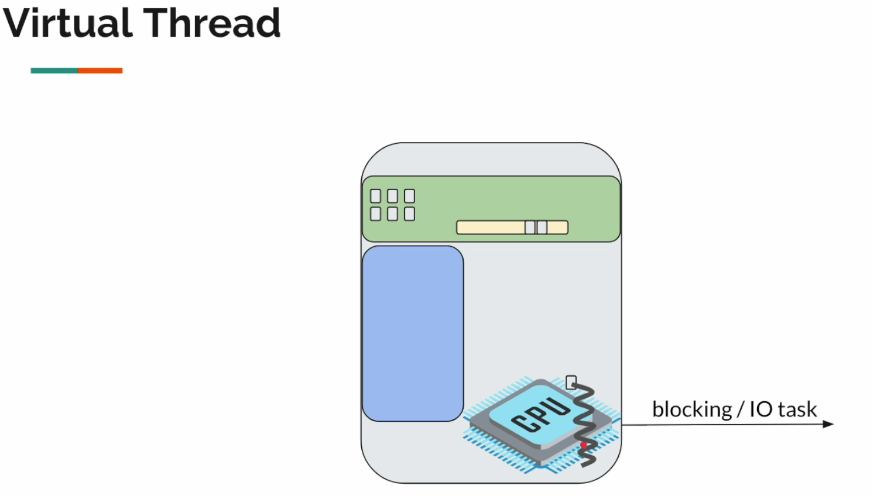

# Exploring Java Virtual Threads

Here is how we set up our project environment on IntelliJ IDEA:


We also need a few dependencies:

- Logback
- Enable preview of Java 21

The code will be updated as we go in the **virtual-threads-playground** project directory.

## Our goal

We had discussed already that in the microservices architecture problem, we deal with tons of network calls, often times thread will be blocked, if we try to increase the number of threads then we have to allocate stack size for these threads which is expensive.

Let's verify if it's really expensive to create threads. Once we know the problem then we can understand the solution better.

To avoid confusions let's refer to Java `Thread` as platform thread. To simulate the slow network, I/O calls, we would be using `Thread.sleep()` in the first examples. Our examples on this section will be located on the package `section01`.

Let's create our first class named `Task` and there we will define a method to simulate the slow network call.

```java
public class Task {

    private static final Logger LOGGER = LoggerFactory.getLogger(Task.class);

    public static void ioIntensiveOp(int i) {

        try {
            LOGGER.info("starting I/O task: {}", i);

            Thread.sleep(Duration.ofSeconds(10));

            LOGGER.info("ending I/O task: {}", i);
        } catch (InterruptedException e) {
            throw new RuntimeException(e);
        }
    }
}
```

Now let's create our second class named `InboundOutboundTaskDemo` and there we will define a method to simulate the network calls.

```java
public class InboundOutboundTaskDemo {

    private static final int TEN_PLATFORM = 10;
    private static final int TEN_MILLION_PLATFORM = 10000000;

    public static void main(String[] args) {
        smallPlatformThreadDemo();
        /*
            Output should look like the following (order of tasks will vary at each call)
            00:38:26.722 [Thread-6] INFO com.bodera.section01.Task -- starting I/O task: 6
            00:38:26.722 [Thread-7] INFO com.bodera.section01.Task -- starting I/O task: 7
            00:38:36.731 [Thread-7] INFO com.bodera.section01.Task -- ending I/O task: 7
            00:38:36.731 [Thread-6] INFO com.bodera.section01.Task -- ending I/O task: 6
            ... (other threads goes along)

            We can actually name our Java threads (aka OS Threads) and for our virtual threads
         */

        //hugePlatformThreadDemo();
        // The line above is most probably expected to raise an OutOfMemoryException
    }

    private static void smallPlatformThreadDemo() {
        threadStarter(TEN_PLATFORM);
    }

    private static void hugePlatformThreadDemo() {
        threadStarter(TEN_MILLION_PLATFORM);
    }

    private static void threadStarter(int numberOfThreads) {
        for (int i = 0; i < numberOfThreads; i++) {
            int j = i;

            Thread thread = new Thread(() -> Task.ioIntensiveOp(j));
            thread.start();

            // On production code we really don't want to create threads like this
            // Is most common to use a thread pool executor service or something related
            // We are just using it here for learning purposes.
        }
    }
}
```

Behind the curtains, whenever we call `Thread.start()` Java calls a native method to create the underlying platform thread. This is the `pthread_create` which comes from a C library to create POSIX threads, it's a standard for creating threads in the Unix-like machines (Linux, Mac), but Windows machines Java may call `winpthreads` instead for doing this job.

So when we called `hugePlatformThreadDemo()` we get the following:

```bash
Failed to start thread "Unknown thread" - pthread_create failed (EAGAIN) for attribute: stacksize=2048k, guardsize=16k, detachstate.
Exception in thread "main" java.lang.OutOfMemoryError: unable to create native thread: possible out of memory or process/resource limits reached
at java.base/java.lang.Thread.start0(Native Method)
```

Is not always because system is out of memory that this exception is thrown, sometimes it can be because we have too many threads, or we have too many threads with too much stack size. The underlying OS will not give us the flexibility to create millions of threads.

## Thread builder factory method

Before JDK 21 we used to create threads by calling `new Thread(Runnable)` and then call `Thread.start()` to start the thread.

```java
Thread thread = new Thread(() -> Task.ioIntensiveOp(i));
thread.start();
```

Now in JDK 21 we can use a `Thread.Builder.OfPlatform` to create our threads.

```java
Thread thread = Thread.ofPlatform().unstarted(() -> Task.ioIntensiveOp(i));
thread.start();
```

When we create threads like this we call them **non-daemon threads** or **foreground threads**, so they will not be terminated when the main thread is terminated just only when the JVM is terminated (our main application). So after `threadStarter()` is done executing our non-daemon threads will not be terminated until our `InboundOutboundTaskDemo.main()` is terminated (which is our main application).

Sometimes you might want to create threads to run in background mode, we call them **daemon threads**. To create a daemon thread we use the `Thread.Builder.OfPlatform.daemon()` method.

```java
Thread thread = Thread.ofPlatform().daemon().unstarted(() -> Task.ioIntensiveOp(i));
thread.start();
```

If we try to run the daemon thread our application will just exit immediately.

```bash
> Task :compileJava
> Task :processResources NO-SOURCE
> Task :classes
> Task :com.bodera.section01.InboundOutboundTaskDemo.main()

BUILD SUCCESSFUL in 233ms
```

That's because in our `threadStarterDaemon()` our main thread created ten background threads, and it exits immediately after without waiting for daemon threads to complete their tasks. That's how daemon threads works.

But how can we make our applications wait the background threads to finish their execution? And how we are talking about this without mentioning virtual threads? And if we have to wait for the application to do the job, why we are creating daemon threads in the first place? We will have a better insight on this on the next section.

But first let's see how can we make our applications wait the background threads to finish their execution. That's a job for `CountDownLatch`.

The `CountDownLatch` is nothing new, was present in Java since 1.5as part of the `java.util.concurrent package`. It's a synchronization aid that allows one or more threads to wait until a set of operations being performed in other threads completes.

Common use cases for `CountDownLatch` include:

- Waiting for multiple threads to complete initialization before starting a service
- Coordinating the execution of multiple threads in a test scenario
- Implementing a "barrier" that allows threads to wait for each other to reach a certain point

So we can use it to wait for the background threads to complete their jobs.

```java
var latch = new CountDownLatch(numberOfThreads); //number of tasks

for (int i = 0; i < numberOfThreads; i++) {
    int j = i;

    Thread thread = Thread.ofPlatform().daemon().unstarted(() -> {
        Task.ioIntensiveOp(j);
        latch.countDown(); //decrement the count to indicate that the task is done
    }
    thread.start();
}
latch.await(); //wait until all tasks are done
```

In Java, a thread can be in a state where it has finished its task, but the thread itself is still alive. This is because the thread's task is typically executed in a `run()` method, and when that method completes, the thread's task is done. However, the thread itself may still be in a state where it's waiting for other threads to finish, or waiting for some other condition to be met, before it can actually exit.

Think of it like a worker who has finished their assigned task, but is still waiting for their manager to give them further instructions or to confirm that they can go home. The worker has finished their task, but they're still "on the clock" and haven't actually left the workplace yet.

In Java, when a thread finishes its task, it's said to be in a state of "completion", but it's not necessarily "terminated". A thread is only terminated when it's actually completed and is no longer running.

The `CountDownLatch` is typically used to wait for a thread to finish its task, whereas `Thread.join()` is used to wait for the thread to actually terminate.

Here's a code snippet combining `CountDownLatch` and `Thread.join()`:

```java
CountDownLatch taskCountDown = new CountDownLatch(numberOfThreads);
Thread.Builder.OfPlatform threadBuilder = Thread.ofPlatform().daemon().name("bodera.daemon", 1);

Thread[] threads = new Thread[numberOfThreads];

for (int i = 0; i < numberOfThreads; i++) {
    int j = i;

    threads[i] = threadBuilder.unstarted(() -> {
        Task.ioIntensiveOp(j);
        taskCountDown.countDown();
    });
    threads[i].start();
}

taskCountDown.await();

// Wait for each thread to finish
for (Thread thread : threads) {
    thread.join();
}
```

## Virtual threads scaling

We understood the problem with the platform threads, we reach some resource limits. At this point we can talk about virtual threads.

Java 21 has introduced a new class called `VirtualThread` which extends the original `Thread` class.

```
-> public Thread (Platform Thread)
----> abstract BaseVirtualThread
--------> (package private) VirtualThread
```

So consider the following code:

```java
void startThread(Thread thread) {
    thread.start();
}
```

On the example above the parameter `thread` can be either a platform thread or a virtual thread.

We cannot directly create a virtual thread by saying `new VirtualThread()` because it is package private. This is why Java has also introduced the `Thread.Builder`, which we have already used on previous examples. The `Thread.Builder` is an interface with two different implementations:

- `Thread.ofPlatform()` for creating platform threads
- `Thread.ofVirtual()` for creating virtual threads

Consider the following code:

```java
Thread createThread(Thread.Builder builder) {
    return builder.unstarted(() -> someTask());
}
```

On the example above we should be able to create both a platform thread or a virtual thread.

Now let's explore a bit more of virtual threads.

```java
public void static main(String[] args) {
    smallVirtualThread();
}

private static void threadStarterVirtual() {
    Thread.Builder.OfVirtual threadBuilder = Thread.ofVirtual().name("bodera.virutal", 1);

    for (int i = 0; i < 10; i++) {
        int j = i;

        Thread thread = threadBuilder.unstarted(() -> Task.ioIntensiveOp(j));
        thread.start();
    }
}
```

If we run the method `main()` we will get the following:

```bash
> Task :compileJav
> Task :processResources NO-SOURCE
> Task :classes
> Task :com.bodera.section01.InboundOutboundTaskDemo.main()
BUILD SUCCESSFUL in 5s

Process finished with exit code 0
```

We get no output! That's because virtual threads are daemon threads by default. We cannot create a non-daemon virtual thread.

So let's try to apply `CountDownLatch` to virtual threads.

```java
public void static main(String[] args) {
    threadStarterVirtualSync();
}

private static void threadStarterVirtualSync() {
    try {
        CountDownLatch taskCountDown = new CountDownLatch(10);
        Thread.Builder.OfVirtual threadBuilder = Thread.ofVirtual().name("bodera.virtual", 1);

        for (int i = 0; i < 10; i++) {
            int j = i;

            Thread thread = threadBuilder.unstarted(() -> {
                Task.ioIntensiveOp(j);
                taskCountDown.countDown();
            });
            thread.start();
        }

        taskCountDown.await();
    } catch (InterruptedException e) {
        throw new RuntimeException(e);
    }
}
```

If we run the method `main()` we will get the following:

```bash
> Task :compileJava
> Task :processResources NO-SOURCE
> Task :classes
> Task :com.bodera.section01.InboundOutboundTaskDemo.main()

10:33:21.785 [bodera.virtual7] INFO com.bodera.section01.Task -- starting I/O task: 6
10:33:21.785 [bodera.virtual2] INFO com.bodera.section01.Task -- starting I/O task: 1
10:33:21.785 [bodera.virtual8] INFO com.bodera.section01.Task -- starting I/O task: 7
10:33:21.785 [bodera.virtual1] INFO com.bodera.section01.Task -- starting I/O task: 0
10:33:21.785 [bodera.virtual9] INFO com.bodera.section01.Task -- starting I/O task: 8
10:33:21.785 [bodera.virtual6] INFO com.bodera.section01.Task -- starting I/O task: 5
10:33:21.785 [bodera.virtual4] INFO com.bodera.section01.Task -- starting I/O task: 3
10:33:21.785 [bodera.virtual5] INFO com.bodera.section01.Task -- starting I/O task: 4
10:33:21.785 [bodera.virtual3] INFO com.bodera.section01.Task -- starting I/O task: 2
10:33:21.785 [bodera.virtual10] INFO com.bodera.section01.Task -- starting I/O task: 9
10:33:31.800 [bodera.virtual4] INFO com.bodera.section01.Task -- ending I/O task: 3
10:33:31.801 [bodera.virtual2] INFO com.bodera.section01.Task -- ending I/O task: 1
10:33:31.801 [bodera.virtual10] INFO com.bodera.section01.Task -- ending I/O task: 9
10:33:31.803 [bodera.virtual3] INFO com.bodera.section01.Task -- ending I/O task: 2
10:33:31.803 [bodera.virtual6] INFO com.bodera.section01.Task -- ending I/O task: 5
10:33:31.803 [bodera.virtual9] INFO com.bodera.section01.Task -- ending I/O task: 8
10:33:31.803 [bodera.virtual7] INFO com.bodera.section01.Task -- ending I/O task: 6
10:33:31.803 [bodera.virtual8] INFO com.bodera.section01.Task -- ending I/O task: 7
10:33:31.803 [bodera.virtual1] INFO com.bodera.section01.Task -- ending I/O task: 0
10:33:31.804 [bodera.virtual5] INFO com.bodera.section01.Task -- ending I/O task: 4

BUILD SUCCESSFUL in 10s

Process finished with exit code 0
```

Virtual threads are **unnamed by default**. We can name them by using the `Thread.Builder.OfVirtual.name()` method.

Now where they really shines is about resource management. Remember when we get out of limits when creating tons of platform threads? Virtual threads are the perfect solution for that, also known as fibers or green threads, they are lightweight threads that run on top of a single operating system thread. They are scheduled by the Java Virtual Machine (JVM) and do not have a direct mapping to a native thread. This means that virtual threads do not run in parallel with the main thread in the classical sense, but rather are executed by the JVM in a way that mimics parallelism.

## How virtual threads work

Okay, Java virtual threads are simply an illusion provided by Java:

- It will look like a thread
- It will accept a `Runnable`
- We can do `thread.start()` and `thread.join()` as usual

But the underlying operating system cannot see/schedule them! If the underlying OS doesn't handle virtual threads then how does it work?

To understand virtual threads, let's consider the following example:


Your machines consist in the parts shown in the figure above. Whatever the code we write, object-oriented programming, functional style, reactive programming, all those things do not matter to the OS, programming paradigm only matters for us developers not for the OS.

So the programming languages are an interface in which we interact with the OS to pass some given set of instructions to perform.

In our first demo, the `platformThreadDemo()`, we were trying to create thousands of Java threads. And Java threads are the same as platform threads, so because of that it was trying to create too many OS threads, then the OS itself started providing some kind of restriction blocking our app to invoke the creation of more threads.


Now the thing is, when we create virtual threads they are just like regular objects like this one:

```java
Person p = new Person("Alice");
```

By looking at the statement above, we should no worry about creating thousands instances of `Person` in a loop, right? We could store them in data structure similar to an `ArrayList` or something related.

Similarly, the virtual threads are not platform threads, so nothing is created in the OS level! They are like tiny objects we create in the heap memory.


To understand virtual thread, we should stop seeing them as `Thread`, instead we should start seeing them as `Task`.

Those virtual threads, they accept a `Runnable`, right? So they all hold some kind of actions to be executed. It will look like we are using a thread, that we are even starting a new thread and doing something with the thread. However, whenever we call `Thread.Builder.OfVirtual.start()`, all those tasks, those virtual threads, they are going to be added to a **queue** on the RAM.


If the OS processor cannot be aware of the existence of virtual threads then it cannot execute them on its own. They belong to a _fork-join pool_, not the common pool of threads. The number of threads in this _fork-join pool_ depends on the number of processors we have in our machine. Consider that due to our single core CPU in our example, the _fork-join pool_ is going to be a single thread, a **platform thread**. This dedicated platform thread will take the tasks from the queue and will start executing them.

So behind the scenes, all the virtual threads, everything is getting executed by a platform thread. How many platform threads will be used for that depends on the number of processors available on the machine.

But as part of the `Runnable` we had given `Thread.sleep()`, if the platform thread is what is actually executing that task, then this platform thread should be blocked, right? How come we were able to execute millions of `Thread.sleep()` in parallel? Sounds unreasonable, right?

This is where Java does it magic.



Ok, the platform thread will pick up the task and will start executing whenever it sees a `Thread.sleep()` or some kind of network call, whenever it detects this type of blocking, what it will do is take that task and put it back into the **heap**, we call that action __"parking"__. The ultimate goal is that the platform thread should never be blocked, as long as there are available tasks on the **queue**, the platform thread will start executing them and when it detects some blocking call or network call, it stages the idle task back into the heap till the response comes back.


We name these platform threads as _"carrier threads"_. Since the virtual threads are tiny objects in the heap, and they cannot be directly executed on its own, the virtual threads will have to be __mounted__ on a carrier thread to execute their task.

Then we will be executing the task as part of the `Runnable`. Let's imagine that we're calling a remote service `ProductService` to get the product information. So we will be sending a request to the product service to get the product information, since it's a network call, it might take some time, so we will not be waiting till the response comes back. The virtual thread that performed that call will be __unmounted__ and then __parked__ back into the queue. Then the next available virtual thread on the queue will be mounted again to get executed. The strategy consists in not letting the carrier thread to be set idle, repeating this process over and over.

What happens if the response comes back? Then we're going to __unpark__ the virtual thread by adding it back to the __queue__ so that it can be __mounted__ on a carrier thread again to execute its task. It will continue from the place where it stopped.

We're going to get in details on how this work further on our lectures, but in a high level, this is how the virtual threads are getting scheduled for the execution.

If the virtual thread is mounted on a carrier thread, and if the carrier thread is what is executing the task, then we have some methods like:

```java
Thread.currentThread().getName();
Thread.currentThread().getState();
```

If we call upon these methods, what will be the output? Would we get the virtual thread name and state, or the carrier thread name and state? That's a very good question.

Okay, so the virtual thread is mounting on a carrier thread and all its implementation details. You and I are the Java developers, so basically we are the users of the Java platform ok. For us there are two threads, one is virtual, the other one is platform. So the Java is trying to provide the magic illusion behind the scenes for us, but in this case when we are using virtual threads in our code, we should be getting the virtual thread name and state. But how does it happen?

Check out the following code from the `VirtualThread.mount()` method:

```java
/**
 * Mounts this virtual thread onto the current platform thread. On
 * return, the current thread is the virtual thread.
 */
@ChangesCurrentThread
@ReservedStackAccess
private void mount() {
    // sets the carrier thread
    Thread carrier = Thread.currentCarrierThread();
    setCarrierThread(carrier);

    // sync up carrier thread interrupt status if needed
    if (interrupted) {
        carrier.setInterrupt();
    } else if (carrier.isInterrupted()) {
        synchronized (interruptLock) {
            // need to recheck interrupt status
            if (!interrupted) {
                carrier.clearInterrupt();
            }
        }
    }

    // set Thread.currentThread() to return this virtual thread
    carrier.setCurrentThread(this);
}
```

After mounting the virtual thread on a carrier thread, we are also modifying the carrier thread on this line `carrier.setCurrentThread(this);`. This process is reverted when we call `VirtualThread.unmount()`.

If we look at `Thread.sleep()`, the actual Java source code looks like this:

```java
public static void sleep(long nanos) throws InterruptedException {
    if (currentThread() instanceof VirtualThread vthread) {
        vthread.sleepNanos(nanos); // if is virtual sleep this way
    } else {
        sleep0(nanos); // if is platform sleep this way
    }
}
```

The native `sleep0()` is a native method call where we ask the OS to not schedule the current thread for given nanoseconds. So that any further instructions will not be executed for the given nanoseconds. This is a blocking operation.

The `sleepNanos()` method on other hand performs another call to the `parkNanos()` methods to park the current virtual thread for the given nanoseconds. Inside there it will also immediately schedule unparking after the given nanoseconds by calling this:

```java
Future<?> unparker = scheduleUnpark(this::unpark, nanos);
```

Again, that task will be taken and added to the queue after the given nanoseconds. This is how virtual threads looks like in slept state. The Java team have modified hundreds of files for us.

Now what about the stack memory? Threads will have something like a stack memory right, so those virtual threads are supposed to have something like that too. Do they have or not? We will explain that in the next lecture.

### A note about virtual threads and fork-join pool

The fork-join pool is a type of executor service in Java that's designed to efficiently execute tasks that can be divided into smaller sub-tasks. It's particularly useful for parallelizing computationally intensive tasks.

In the context of Java virtual threads (also known as _"fibers"_ or _"green threads"_), a fork-join pool can be used to execute tasks that are scheduled on a dedicated platform thread. This means that the fork-join pool will use a native thread to execute the tasks, but the tasks themselves will be executed as virtual threads.

The idea is that the platform thread will act as a "carrier" for the virtual threads, allowing them to run on the native thread while still providing the benefits of virtual threads, such as lightweight scheduling and reduced memory overhead.

By using a fork-join pool with virtual threads, you can take advantage of the efficiency and scalability of parallel processing while minimizing the overhead of thread creation and management.

```java
import java.util.concurrent.ForkJoinPool;
import java.util.concurrent.RecursiveTask;

public class VirtualThreadExample extends RecursiveTask<Integer> {
    // ...

    public static void main(String[] args) {
        ForkJoinPool pool = new ForkJoinPool();
        VirtualThreadExample task = new VirtualThreadExample();
        pool.invoke(task);
    }
}
```

Note that this is just a brief overview, and there are many more details to explore when working with fork-join pools and virtual threads in Java.

By default, a `ForkJoinPool` will use a target parallelism level that's equal to the number of available processors, which is typically the number of cores on your machine. However, the actual number of platform threads used by the pool can vary depending on the workload and the configuration of the pool.

In your case, if you have 10 processors available, the `ForkJoinPool` will likely use a target parallelism level of 10, which means it will try to use up to 10 platform threads to execute tasks concurrently. However, the pool may not always use all 10 threads simultaneously, and it may also use more threads than the target parallelism level if the workload requires it.

You can also configure the parallelism level of the `ForkJoinPool` explicitly by passing a value to the constructor, like this:

```java
ForkJoinPool pool = new ForkJoinPool(10);
```

This sets the target parallelism level to 10, but again, the actual number of platform threads used by the pool may vary.

It's worth noting that `ForkJoinPool` uses a technique called _"work-stealing"_ to manage its threads, which means that idle threads will actively search for work to do, and busy threads will try to offload work to idle threads. This helps to ensure that the pool is using its threads efficiently, even if the workload is uneven.

## Carrier threads demo

On the previous lesson we saw how virtual threads works behind the scenes, and how they get executed by carrier threads. Let's see carrier threads in action.

First we need to modify the `Task` class a bit.

```java
public static void ioIntensiveOp(int i) {
    try {
        LOGGER.info("starting I/O task: {}. Thread info: {}", i, Thread.currentThread());

        Thread.sleep(Duration.ofSeconds(10));

        LOGGER.info("ending I/O task: {}. Thread info: {}", i, Thread.currentThread());
    } catch (InterruptedException e) {
        throw new RuntimeException(e);
    }
}
```

After that, let's go back to out `InboundOutboundTaskDemo` class and check how the platform threads are getting executed after our modification on the `Task` class.

```java
public class InboundOutboundTaskDemo {

    public static void main(String[] args) {
        smallPlatformThreadNonDaemon();
    }
}
```

Sample output:

```
> Task :com.bodera.section01.InboundOutboundTaskDemo.main()
02:19:49.391 [bodera4] INFO com.bodera.section01.Task -- starting I/O task: 4. Thread info: Thread[#32,bodera4,5,main]
02:19:49.391 [bodera3] INFO com.bodera.section01.Task -- starting I/O task: 3. Thread info: Thread[#31,bodera3,5,main]
02:19:49.391 [bodera2] INFO com.bodera.section01.Task -- starting I/O task: 2. Thread info: Thread[#30,bodera2,5,main]
02:19:49.391 [bodera1] INFO com.bodera.section01.Task -- starting I/O task: 1. Thread info: Thread[#29,bodera1,5,main]
02:19:49.391 [bodera5] INFO com.bodera.section01.Task -- starting I/O task: 5. Thread info: Thread[#33,bodera5,5,main]
02:19:49.391 [bodera6] INFO com.bodera.section01.Task -- starting I/O task: 6. Thread info: Thread[#34,bodera6,5,main]
02:19:49.391 [bodera10] INFO com.bodera.section01.Task -- starting I/O task: 10. Thread info: Thread[#38,bodera10,5,main]
02:19:49.391 [bodera7] INFO com.bodera.section01.Task -- starting I/O task: 7. Thread info: Thread[#35,bodera7,5,main]
02:19:49.391 [bodera8] INFO com.bodera.section01.Task -- starting I/O task: 8. Thread info: Thread[#36,bodera8,5,main]
02:19:49.391 [bodera9] INFO com.bodera.section01.Task -- starting I/O task: 9. Thread info: Thread[#37,bodera9,5,main]
```

Let's dissect this a bit more.

```
Thread info: Thread[#37,bodera9,5,main]
```

* `Thread info` is the header indicating that the following information is about a thread.
* `#37` is the thread ID, a unique identifier for the thread.
* `bodera9` is the thread name, which can be set by the developer or automatically generated by the JVM.
* `5` is the thread priority, which determines the order in which threads are scheduled to run.
* `main` is the thread group, which is a way to organize related threads together. But it can also be the parent thread's name.

Now let's examine the output of the `InboundOutboundTaskDemo` class when we run it for virtual threads.

```java
public class InboundOutboundTaskDemo {

    public static void main(String[] args) {
        smallVirtualThreadNonDaemon();
    }
}
```

Sample output:

```
> Task :com.bodera.section01.InboundOutboundTaskDemo.main()
02:26:54.141 [bodera.virtual10] INFO com.bodera.section01.Task -- starting I/O task: 10. Thread info: VirtualThread[#39,bodera.virtual10]/runnable@ForkJoinPool-1-worker-10
02:26:54.141 [bodera.virtual9] INFO com.bodera.section01.Task -- starting I/O task: 9. Thread info: VirtualThread[#38,bodera.virtual9]/runnable@ForkJoinPool-1-worker-9
02:26:54.141 [bodera.virtual3] INFO com.bodera.section01.Task -- starting I/O task: 3. Thread info: VirtualThread[#32,bodera.virtual3]/runnable@ForkJoinPool-1-worker-3
02:26:54.141 [bodera.virtual7] INFO com.bodera.section01.Task -- starting I/O task: 7. Thread info: VirtualThread[#36,bodera.virtual7]/runnable@ForkJoinPool-1-worker-7
02:26:54.141 [bodera.virtual1] INFO com.bodera.section01.Task -- starting I/O task: 1. Thread info: VirtualThread[#29,bodera.virtual1]/runnable@ForkJoinPool-1-worker-1
02:26:54.141 [bodera.virtual8] INFO com.bodera.section01.Task -- starting I/O task: 8. Thread info: VirtualThread[#37,bodera.virtual8]/runnable@ForkJoinPool-1-worker-8
02:26:54.141 [bodera.virtual4] INFO com.bodera.section01.Task -- starting I/O task: 4. Thread info: VirtualThread[#33,bodera.virtual4]/runnable@ForkJoinPool-1-worker-4
02:26:54.141 [bodera.virtual6] INFO com.bodera.section01.Task -- starting I/O task: 6. Thread info: VirtualThread[#35,bodera.virtual6]/runnable@ForkJoinPool-1-worker-6
02:26:54.141 [bodera.virtual2] INFO com.bodera.section01.Task -- starting I/O task: 2. Thread info: VirtualThread[#31,bodera.virtual2]/runnable@ForkJoinPool-1-worker-2
02:26:54.141 [bodera.virtual5] INFO com.bodera.section01.Task -- starting I/O task: 5. Thread info: VirtualThread[#34,bodera.virtual5]/runnable@ForkJoinPool-1-worker-5
```

Let's dissect this a bit more.

```
Thread info: VirtualThread[#34,bodera.virtual5]/runnable@ForkJoinPool-1-worker-5
```

* `Thread info` is the header, as before.
* `VirtualThread` indicates that this is a virtual thread, which is a lightweight thread that can be used for concurrent programming.
* `[#34,bodera.virtual5]` is the thread ID and name, similar to before.
* `/runnable` indicates the thread's current state, which is "runnable". This means the thread is ready to run and is waiting for the scheduler to allocate it a CPU.
* `@ForkJoinPool-1-worker-5` is the thread's context, which indicates that it's part of a ForkJoinPool. Specifically, it's worker thread #5 in pool #1.

So as we proved, virtual threads can't execute themselves, they must run upon a `ForkJoinPool`'s worker thread.

Now let's take the `ForkJoinPool-1-worker-5` to see what's going on. The full line when it was in the starting state looks like this:

```
02:26:54.141 [bodera.virtual5] INFO com.bodera.section01.Task -- starting I/O task: 5. Thread info: VirtualThread[#34,bodera.virtual5]/runnable@ForkJoinPool-1-worker-5
```

It was linked to the task `[bodera.virtual5]` right? But since it was sleeping, the carrier thread must have parked this thread, and later unparked it. As we can see in the full line of the ending state:

```
02:27:04.172 [bodera.virtual5] INFO com.bodera.section01.Task -- ending I/O task: 5. Thread info: VirtualThread[#34,bodera.virtual5]/runnable@ForkJoinPool-1-worker-3
```

Notice how a different worker thread was selected to continue the ending state of the task `bodera.virtual5` virtual thread. It was initialized with `ForkJoinPool-1-worker-5` and finally ended up with `ForkJoinPool-1-worker-3`.

We're observing is a common behavior in `ForkJoinPool`, where a virtual thread can be executed by different worker threads at different points in its lifetime.

Here's what's happening:

1. When the virtual thread bodera.virtual5 is created, it's assigned to worker thread ForkJoinPool-1-worker-5 (as seen in the starting state).
2. When the virtual thread needs to block (e.g., due to I/O or sleep), the carrier thread (in this case, ForkJoinPool-1-worker-5) parks the virtual thread, releasing its resources.
3. Later, when the virtual thread is unparked and ready to continue execution, the ForkJoinPool's scheduler assigns it to a new worker thread, which happens to be ForkJoinPool-1-worker-3 (as seen in the ending state).

This behavior is known as "work stealing" or "thread migration". The idea is that the `ForkJoinPool`'s scheduler can dynamically reassign tasks (virtual threads) to different worker threads to optimize resource utilization and minimize idle time.

In this case, the scheduler decided to move the virtual thread of the task `bodera.virtual5` from worker thread `ForkJoinPool-1-worker-5` to `ForkJoinPool-1-worker-3` when it was unparked. This might be because `ForkJoinPool-1-worker-5` was busy with other tasks or was idle, and the scheduler wanted to utilize `ForkJoinPool-1-worker-3` instead.

So, to summarize, the change in worker thread from `ForkJoinPool-1-worker-5` to `ForkJoinPool-1-worker-3` is a result of the `ForkJoinPool`'s scheduler dynamically reassigning the virtual thread to optimize resource utilization.

In this case, the `ForkJoinPool` is acting as the **carrier thread pool**, not just a single carrier thread!

The `ForkJoinPool` is a thread pool that manages a set of worker threads, and it's responsible for executing the virtual threads. When a virtual thread is created, it's submitted to the `ForkJoinPool`, which then assigns it to one of its worker threads for execution.

So, in this case, the `ForkJoinPool` is the entity that's managing the execution of the virtual threads, including task `bodera.virtual5`. The worker threads within the `ForkJoinPool`, such as `ForkJoinPool-1-worker-5` and `ForkJoinPool-1-worker-3`, are the actual threads that execute the virtual threads.

Think of it like a hierarchy:

- ForkJoinPool (carrier thread pool)
  - Worker threads (e.g., ForkJoinPool-1-worker-5, ForkJoinPool-1-worker-3)
    - Virtual threads (e.g., bodera.virtual5)

Virtual threads are an abstraction provided by Java to simplify concurrent programming and optimize resource management. They're designed to make it easier to write concurrent code without worrying about the underlying thread management.

In reality, virtual threads are not actual threads in the classical sense. Instead, they're a way to execute tasks on a pool of underlying threads, which are managed by the Java runtime. This approach allows for more efficient use of resources, as the number of underlying threads can be dynamically adjusted based on the workload.

By using virtual threads, you can write concurrent code that's more concise, readable, and maintainable, without having to worry about the complexities of thread management. The Java runtime takes care of the underlying thread scheduling, synchronization, and resource allocation, freeing you to focus on the logic of your program.

There is no guarantee that the same worker/carrier thread will be doing all the execution for the virtual thread.

## Virtual threads and Stack memory

Now let's discuss how the stack memory work with virtual threads, because we know that platform threads will have something called **stack memory** to store the local method variables, method calls information, etc. But what about virtual threads? How this data is keep in memory for virtual threads?

- Platforms threads have **fixed stack**. (1MB, 2MB, ...)

Even though we can adjust the stack size, remember that the size has to be given upfront before we create them. Once the platform thread is created we cannot adjust the stack size anymore, and it has to be a reasonable size.

- Virtual threads do NOT have fixed stack. They have **resizable stack**.
  - Stack Chunk Object

The way in which it works have to be visualized with the following figure:


Imagine that the virtual thread class is implemented like that pseudocode which accepts a `Runnable` that represents the task to be executed, and they have internally an object called `VirtualStack`.

Based on that class we create three virtual threads, which means three tasks to be executed right. We allocate those objects in the heap. The blue boxes are the runnable tasks, and the white ones are the virtual stack that is always initialized as null, since the task is not yet executed.

Then we have in our example a single processor. The long box corresponds to the carrier thread and the short box corresponds to the available stack memory for the carrier thread (a fixed stack of 1MB or 2MB, doesn't really matter for now).

So when we say `Thread.start()` our virtual threads will be added to a queue for execution, and they're ready to be picked up by a carrier thread for the execution.


Let's imagine that the carrier thread picked up the first task to start executing it. It loads the runnable, or start the virtual thread task as part of the runnable, and maybe we are creating a lot of objects inside, and also having a lot of methods to be called one by one. So, on behalf of the virtual thread, we will be doing everything.

During the execution, the method call information object references, everything has to be stored in the stack, thus our carrier thread will be using its stack memory. Like the red box in the figure below.


Now it has 1GB of stack memory, but probably it would have utilized 10KB or 100KB depending on the task we have inside the runnable. Just keep in mind that all relevant data to the task will be written on the stack (method calls, object references, stack trace, etc.).

During the execution, let's imagine that in the middle of the runnable we have to call a `ProductService` to get some product data. On behalf of the virtual thread the carrier thread will now perform a network call by sending a request to the `ProductService`.


It sends the request, then the platform/carrier thread will immediately realize - "Okay, this is a blocking call, I do not want to be blocked." - What it will do is transfer all that previous information gathered in the stack memory to the that tiny white box on the left side, before performing the **park**.


After completing the parking process, the stack memory will be cleaned because whatever it was storing doesn't belong to the carrier thread anymore, it belongs to the virtual thread that is now in the heap. A little recap, virtual thread executes and the carrier thread notices a blocking I/O call, it allocates the virtual thread and its related stack information on the heap before parking then, after that the carrier thread will pick the next task for the execution, and repeating this process over and over again.

Eventually, for each and every virtual thread, the corresponding stack information will be filled as part of the `VirtualThread` object itself (the pseudocode class). So the stack is now part of the heap, and each virtual thread has its own stack (one has 1KB, other has 250KB, etc.), this is why virtual threads have resizable stack memory.


Depending on the task we are executing they do not have a fixed memory, and they also become part of the heap. That's why virtual threads have resizable stack memory. It's worth noting that the stack memory is not necessarily resized dynamically. Instead, the Java runtime may allocate a larger or smaller stack size for each virtual thread based on the specific requirements of the task being executed.

Now you might wonder, after we have done all the parking, and sent messages to the `ProductService`, what will happen when we get the response back?


Well, once we get the response back, some carrier thread will unpark the virtual thread, and it goes back to the queue to continue the execution. It has to start from the place where it has stopped right? To be able to doing so, the carrier thread will not be losing the context because once it picks the task, every piece of relevant information (methods, object variable, etc.) will be restored back to the stack and then the task will be continued. Due to the object that contains a reference to the stack `VirtualStack` we will not be losing the context.

That does not come for free, it has some cost involved, however this is better than managing thousands of platform threads.
