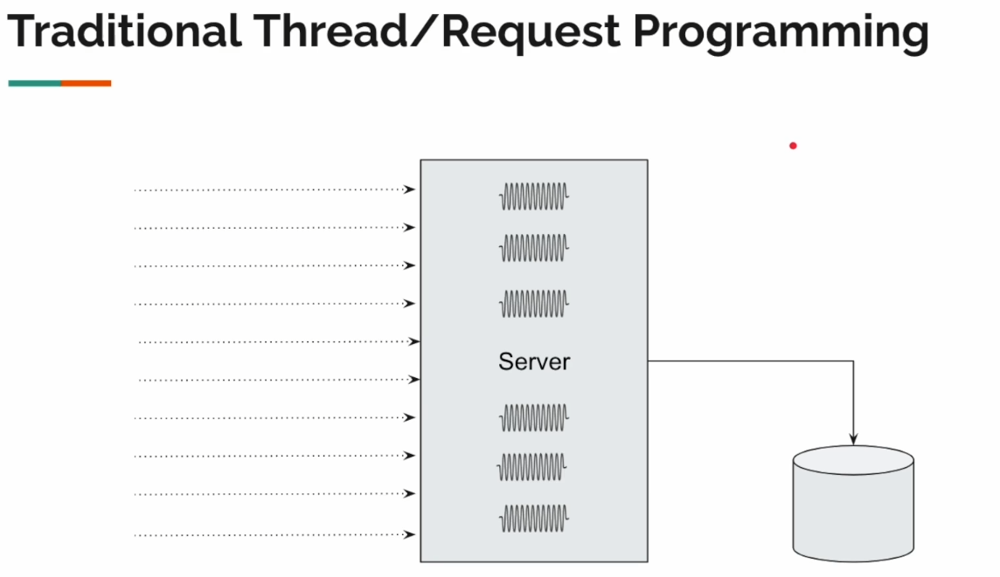
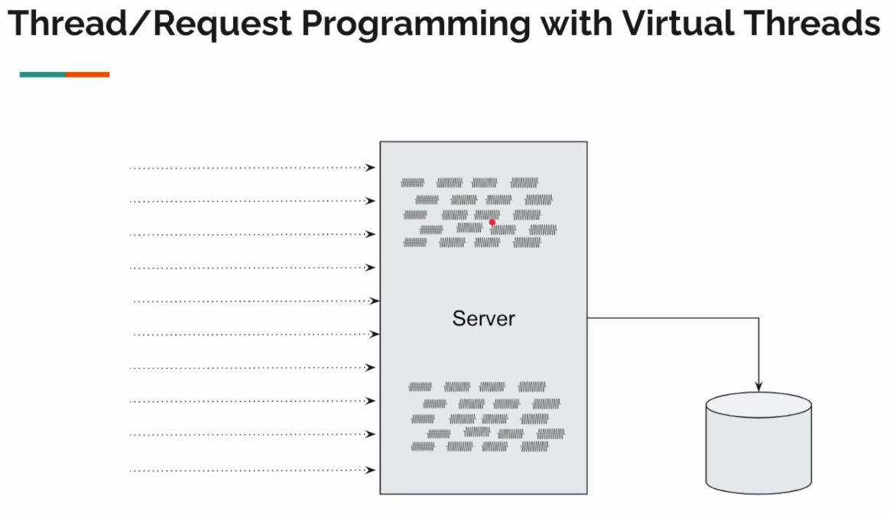

# README

This course is particularly designed for students who are familiar with Java and would like to know more about virtual threads.

As a Java developer, you know that every single statement we write is executed by a thread. A thread is the unit of scheduling, our unit of concurrency.

We, developers, traditionally used multiple threads to handle concurrent requests. For example, Spring Boot Web with the Tomcat, it comes with a default 200 threads to handle up to 200 concurrent requests.

So each and every request will be assigned to a thread to process the request. If we say that each request processing is going to take one second, then our application is capable of processing 200 requests in a second. This is the application **throughput**.

Our application throughput is limited by the number of threads we have available. To increase our throughput, we need to increase the number of threads. But how do we increase the number of threads?

Unfortunately, we cannot increase the number of threads to `Integer.MAX_VALUE` because these threads are OS threads, and OS threads are quite expansive. The operating system will also restrict us from creating too many threads, and we will see this in action on the course.

Java virtual threads are lightweight, and they are not OS threads, so we can create as many virtual threads as we want to make our application more scalable. We can still write code in the traditional thread per request style, even though we can create lots of virtual threads.

Remember, there is a catch by doing this we will explain later on the course.

## Goal

The ultimate goal of this course is to learn how we can develop scalable applications using Java virtual threads.

## Syllabus

- Deep dive into Java Virtual Threads
    - How it works behind the scenes.
    - Uncover limitations.
- `ExecutorService` with Virtual Threads
    - Leveraging `ExecutorService` for effective task management.
- Concurrency with `CompletableFuture`
    - `CompletableFuture` with Virtual Threads for asynchronous operations.
    - Why this is not the same as reactive programming.
- Structured Concurrency (Preview)
    - An insight into Structured Concurrency.
- Developing applications with Virtual Threads
    - Hands-on development with Virtual Threads using Spring Boot Web.
- Testing scalability with JMeter
    - Evaluating application scalability.
    - Comparing **response time** and **throughput** with and without Virtual Threads.

## What about Reactive Programming?

People who have not done reactive programming somehow come to a conclusion that with the introduction of Java Virtual Threads, reactive programming is dead. It is NOT!

Reactive programming is based on a few pillars, virtual threads and the new _structured concurrency_ do not solve everything.
