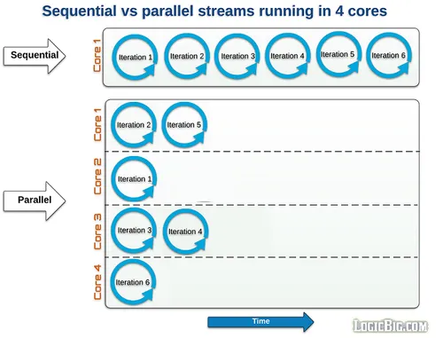

# Parallel Processing

| Sequential Streams | Parallel Streams |
| --- | --- |
| Work just like for-loop using a single core | divide the provided tasks into many and run them in different threads |
| Supports lazy evaluation | Supports lazy evaluation |

You can find an example of the `parallel()` streams processing [here](./src/parallel/StreamParallelExample.java).

To see the available processors, you can use the `Runtime.getRuntime().availableProcessors()` method.

You can find an example comparing the performance of sequential and parallel streams [here](./src/parallel/StreamPerformanceExample.java).

The takeaway here is that parallel streams are faster than sequential streams, but you must consider the scenario first. When you don't need to care about the order of the results, you can use parallel streams.

Not always the parallel streams is the best option. You must consider the amount of data that you are going to process.

The reason why the sequential version is more performant than the parallel version in this case is likely due to the overhead of parallelization.

When you use `parallelStream()` instead of `stream()`, Java creates multiple threads to process the data in parallel. However, this comes with some overhead:

- **Thread creation:** Creating multiple threads takes time and resources.
- **Synchronization:** When using parallel streams, Java needs to synchronize access to shared data structures, which can introduce additional overhead.
- **Data partitioning:** The data needs to be partitioned among the threads, which can lead to additional overhead.

Another red flag to avoid using parallel streams is a scenario you have to modify the original data during the processing, which can also lead to unexpected results beyond the performance decrease.

You can find an example showing a bad usage of parallel streams [here](./src/parallel/StreamParallelBadUseCase.java).
